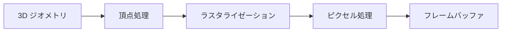

# 第2章 コンピュータグラフィックス入門

第1章で学んだ線形代数・微積分・重心座標は、3D を 2D 画像に落とす **レンダリングパイプライン** の各段階で具体的に使われます。本章では、そのパイプラインの全体像と、微分可能ラスタライザが「差し替え」または「近似」する部分（座標変換・三角形ラスタライゼーション・深度テスト・属性補間）を押さえます。古典的な固定パイプラインの流れを理解することが、のちに **どこを微分可能にし、どこで勾配を定義するか** の設計の土台になります。

---

## 2.1 レンダリングパイプライン概論

### 2.1.1 パイプラインの全体像

3D シーンから 2D 画像（フレームバッファ）を生成する処理は、大まかに次のステージに分けられます。

| ステージ | 入力 | 出力 | 役割 |
|----------|------|------|------|
| **頂点処理** | 頂点位置・属性 | クリップ空間／スクリーン座標・補間用パラメータ | 座標変換（MVP）、法線変換、UV の受け渡し |
| **ラスタライゼーション** | 三角形（3 頂点） | ピクセル（フラグメント）の列 | どのピクセルが三角形に属するか、重心座標 |
| **ピクセル処理** | フラグメント（位置・深度・補間属性） | 色・深度 | シェーディング、深度テスト、ブレンディング |
| **フレームバッファ** | ピクセル色・深度 | 画像 | 可視性が確定した最終画像 |

微分可能ラスタライザでは、**頂点処理**（行列演算）はそのまま微分可能、**ラスタライゼーション** と **深度テスト** が離散演算のためそのままでは微分できず、**ピクセル処理** の属性補間・シェーディングは微分可能に設計します。つまり「ラスタライゼーションと深度テストをどう扱うか」が Part II–IV の核心です。

### 2.1.2 頂点単位とピクセル単位

- **頂点シェーダ**: 各頂点ごとに 1 回実行。位置の変換、法線・UV の変換、カスタム属性の出力。
- **フラグメントシェーダ（ピクセルシェーダ）**: ラスタライザが生成した各フラグメント（ピクセル候補）ごとに 1 回実行。補間された属性を使って色・深度を計算。

逆伝播では「ピクセルでの損失」が **補間された属性** を経由して **頂点** に戻るため、頂点→ピクセルという順方向のデータの流れと、ピクセル→頂点という勾配の流れの両方を意識する必要があります。

---

## 2.2 座標系と変換（モデル・ビュー・射影変換）

第1章で触れた **モデル・ビュー・射影（MVP）** を、パイプライン上の座標系と対応させて整理します。

### 2.2.1 座標系の流れ

1. **モデル空間（オブジェクト空間）**  
   メッシュが定義されている空間。頂点位置・法線・UV は通常ここで与えられる。

2. **ワールド空間**  
   シーン内の絶対座標。モデル変換 $\mathbf{M}_{\text{model}}$ でモデル空間 → ワールド空間。

3. **カメラ（ビュー）空間**  
   カメラを原点にし、視線方向を $-z$ などに揃えた空間。ビュー変換 $\mathbf{M}_{\text{view}}$ でワールド空間 → カメラ空間。

4. **クリップ空間**  
   射影行列 $\mathbf{M}_{\text{proj}}$ を掛けたあとの空間。同次座標 $(x_c, y_c, z_c, w_c)$ の形で、視錐台が例えば $[-w_c, w_c]$ などの範囲に写る。**透視射影では $w_c$ がカメラ空間の深度（またはその線形関数）に対応**し、のちの $1/w$ 補間の根拠になる。

5. **正規化デバイス座標（NDC）**  
   クリップ座標を $w_c$ で割った $(x_c/w_c,\, y_c/w_c,\, z_c/w_c)$。通常 $x,y,z \in [-1,1]$ の範囲が可視領域。

6. **スクリーン（ウィンドウ）座標**  
   NDC を解像度に線形写像。$x_s \in [0, W)$, $y_s \in [0, H)$、多くの API では $y$ が下向き正。ピクセル中心は半整数 $(i+0.5, j+0.5)$ とする流儀が一般的。

まとめると、頂点 $\mathbf{p}_{\text{model}}$ は次のように変形されます。

$$
\mathbf{p}_{\text{clip}} = \mathbf{M}_{\text{proj}} \mathbf{M}_{\text{view}} \mathbf{M}_{\text{model}} \mathbf{p}_{\text{model}}, \qquad
\mathbf{p}_{\text{NDC}} = \frac{1}{w_{\text{clip}}} (x_c, y_c, z_c)^\top
$$

微分可能ラスタライザでは、**頂点位置** や **カメラパラメータ** を最適化するため、損失から $\mathbf{M}_{\text{proj}}\mathbf{M}_{\text{view}}\mathbf{M}_{\text{model}}$ やその入力への勾配が必要になります。行列演算は微分可能なので、自動微分でそのまま扱えます。

### 2.2.2 透視射影と $w$

透視射影行列（例: 縦横比・視野角・近遠クリップ面付き）を掛けると、カメラ空間の $(x_v, y_v, z_v)$ がクリップ空間では $w_c \propto -z_v$（または類似の線形関数）になります。つまり **奥にある点ほど $w_c$ が大きい**。  
NDC では $z_{\text{NDC}} = z_c / w_c$ となり、深度バッファに書き込む値は多くの場合この $z_{\text{NDC}}$ またはその線形変換です。  
重要なのは、**属性の補間** を行うとき、スクリーン空間で線形に補間してよいのは **$1/w$** と **属性/$w$** であるということです（パースペクティブ補正）。第1章の重心座標と組み合わせると、Part III で扱う「補間式の微分」に直結します。

---

## 2.3 三角形ラスタライゼーションの原理

ラスタライザの仕事は、**投影された三角形がどのピクセル（またはサンプル）を覆うか** を決め、各ピクセルに対して **重心座標** と **深度** を渡すことです。

### 2.3.1 三角形の受け渡し

頂点処理の後、3 頂点が 1 組になってラスタライザに渡されます。入力は通常、クリップ空間または NDC の位置 $(x, y, z, w)$ と、各頂点の属性（色・UV・法線など）です。ラスタライザは 2D の **スクリーン座標 $(x_s, y_s)$** と **深度** を使って「どのピクセルが内側か」を判定し、各ピクセルに対する **重心座標 $(b_0, b_1, b_2)$ または $(u, v)$** を計算します。

### 2.3.2 エッジ関数と内外判定

第1章で触れた **エッジ関数** を、2D スクリーン座標で具体的に書きます。  
頂点 $\mathbf{p}_0 = (x_0, y_0)$, $\mathbf{p}_1 = (x_1, y_1)$, $\mathbf{p}_2 = (x_2, y_2)$ を反時計回りに並べた三角形を考えます。エッジ $\mathbf{p}_i \to \mathbf{p}_j$ に対して、点 $\mathbf{q} = (x, y)$ の「エッジの左側にあるか」は、符号付き面積の 2 倍（または符号付き距離）で判定できます。

$$
E_{ij}(\mathbf{q}) = (x - x_i)(y_j - y_i) - (y - y_i)(x_j - x_i)
$$

$\mathbf{q}$ がエッジの左側なら $E_{ij} > 0$、右側なら $E_{ij} < 0$、線上なら $0$ です。  
3 本のエッジすべてで $E \ge 0$ なら $\mathbf{q}$ は三角形の内部または辺上です。  
三角形の符号付き面積の 2 倍は、例えば $A\times2 = E_{12}(\mathbf{p}_0)$ で与えられ、重心座標は $b_0 = E_{12}(\mathbf{q})/(2A)$ のように **エッジ関数の比** で書けます。  
実装では、ピクセル中心 $(i+0.5, j+0.5)$ について $E_{01}, E_{12}, E_{20}$ を計算し、すべて $\ge 0$（または保守的な閾値）ならそのピクセルを三角形に属するとみなします。  
**微分可能ラスタライザ** では、この「内側か外側か」の **離散判定** が微分を阻むため、ソフトマックスで連続化したり、解析的にエッジ付近の勾配を定義したりするアプローチを Part IV で学びます。

### 2.3.3 スキャン変換とタイル

実際の GPU では、三角形を **バウンディングボックス** や **タイル** に区切り、その中のピクセルだけを走査します。また、複数三角形が同じピクセルを覆う場合、**深度テスト** で前面のものだけを残します。これらは実装の効率化と可視性の確定のためで、微分可能性の議論では「どの三角形がそのピクセルに寄与するか」と「そのときの重心座標・深度」が重要になります。

---

## 2.4 深度バッファと可視性判定

### 2.4.1 深度バッファ（Z バッファ）の考え方

各ピクセルについて、**現在までで一番手前の深度値** を保持するバッファが深度バッファです。  
新しいフラグメントを描画するとき、そのピクセル位置での **フラグメントの深度** と **バッファに記録されている深度** を比較し、

- フラグメントのほうが手前（小さい、または API によっては大きい）なら、色と深度を更新し、
- そうでなければフラグメントを破棄する（**深度テスト失敗**）

という処理を行います。これにより、三角形の描画順に依存せず、常に手前の面が表示されます。

### 2.4.2 深度の計算と補間

フラグメントの深度は、**頂点の深度（通常は NDC の $z$ や $z/w$）を重心座標で補間** して得ます。透視補正を行う場合は、$1/w$ と $z/w$ を線形補間し、補間後の深度を $z = (z/w)/(1/w)$ として復元します。  
微分可能ラスタライザでは、**深度テスト** が「どちらの三角形が勝つか」という離散選択になるため、そのままでは勾配が流れません。そのため、

- ソフトラスタライザでは深度をソフトマックスなどで連続化し、両方の三角形に勾配を配分する、
- nvdiffrast のような解析的アプローチでは、見えている三角形についてのみ勾配を定義し、境界（エッジ）では特別な処理をする、

といった方針が取られます（Part IV–V）。

### 2.4.3 背面カリング

多くのパイプラインでは、**法線がカメラを向いていない三角形**（背面）は描画しません。頂点の並び順（ winding order ）とエッジ関数の符号で判定します。微分可能実装でも、背面は勾配をゼロにするか、あるいは意図的に両面に勾配を流すかを設計で選びます。

---

## 2.5 シェーディングの基礎（頂点属性・補間）

### 2.5.1 頂点属性とは

頂点ごとに持たせるデータを **頂点属性** といいます。代表例は次のとおりです。

- **位置**: 必須。モデル空間またはワールド空間。
- **法線**: ライティングやディフューズ計算に使用。
- **UV**: テクスチャ座標。テクスチャサンプリングの微分（Part III, 8 章）で重要。
- **色**: 頂点カラー。そのまま補間して使うことも、シェーダ内で上書きすることも可能。

他に、接線（タンジェント）や頂点カラー、カスタムデータなども属性として渡せます。微分可能ラスタライザでは、**テクスチャ座標 UV** と **法線** への勾配が、テクスチャ最適化や形状・照明の逆推定で特に重要になります。

### 2.5.2 補間の流れ

ラスタライザは各フラグメントに対して **重心座標 $(u, v)$**（および $1-u-v$）を渡します。フラグメントシェーダでは、頂点属性 $A_0, A_1, A_2$ に対して、

- **透視補正なし**（線形）: $A = (1-u-v)A_0 + u A_1 + v A_2$
- **透視補正あり**: $1/w$ と $A/w$ を線形補間してから $A = (A/w)/(1/w)$ で復元

という補間を行います。  
色をそのまま補間する場合は **グーローシェーディング**（頂点色の補間）、法線を補間してからライティングする場合は **フォンシェーディング** に近い処理になります。  
微分可能にするには、**補間式そのもの** は微分可能なので、問題は「そのピクセルにどの重心座標が渡ってくるか」、すなわちラスタライゼーションと深度テストの部分です。Part III では、**スクリーン空間の重心座標** と **3D 空間での属性補間** の関係を式で整理し、$\partial (\text{属性}) / \partial (\text{頂点})$ を導出します。

### 2.5.3 デファード補間（Rasterize-then-Interpolate）

nvdiffrast では、**ラスタライゼーション** と **属性の補間** を API 上分離しています。  
まず「どのピクセルにどの三角形が描かれるか」と「重心座標」だけを計算し（rasterize）、その結果を使って別途「属性の補間」を行う（interpolate）設計です。  
こうすると、

- ジオメトリ（三角形 ID・重心座標）と属性（色・法線・UV）の計算が分離され、
- 勾配の導出と実装が整理しやすく、
- メモリや再計算のトレードオフを切り替えやすい、

という利点があります。Part V（14 章）と Part VI（17 章）で、この設計を詳しく扱います。

---

## 2.6 まとめと次章への接続

- **レンダリングパイプライン**: 頂点処理 → ラスタライゼーション → ピクセル処理 → フレームバッファ。微分可能にするにはラスタライゼーションと深度テストの扱いが鍵。
- **座標系**: モデル → ワールド → カメラ → クリップ → NDC → スクリーン。透視では $w$ と $1/w$ 補間が重要。
- **三角形ラスタライゼーション**: エッジ関数で内外判定、重心座標をエッジ関数の比で計算。離散判定が微分の障壁になる。
- **深度バッファ**: 手前のフラグメントを残す離散選択。ソフト化または解析的勾配で逆伝播を設計する。
- **シェーディング**: 頂点属性を重心座標で補間（透視補正あり／なし）。補間式は微分可能；デファード補間でラスタライザと属性計算を分離できる。

次章（第 3 章）では **深層学習と自動微分** を学び、PyTorch / JAX で勾配がどのように計算され、**カスタムのラスタライザを組み込んだ計算グラフ** で逆伝播をどう流すかを理解します。これにより、Part II 以降で「微分可能ラスタライザ」を実装するときの土台が揃います。

---

*前: [第 1 章 数学の基礎](Chapter01.md) | 次: [第 3 章 深層学習と自動微分](Chapter03.md)*
