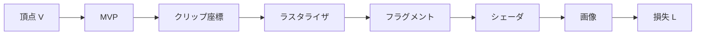

# 第3章 深層学習と自動微分

第1章で連鎖律と勾配を、第2章でレンダリングパイプラインを学びました。本章では、**自動微分（autograd）** の仕組みと、PyTorch・JAX で勾配がどのように計算されるかを整理します。微分可能ラスタライザを「既存のレイヤーのように」学習可能なモジュールとして組み込むには、**計算グラフ** にどう接続し、**backward** で勾配をどう返すかを理解している必要があります。Part V でカスタム演算（custom op）を実装するとき、この章の内容がそのまま設計の指針になります。

---

## 3.1 自動微分（autograd）の仕組み

### 3.1.1 数値微分と記号微分との違い

勾配を求める方法には主に三つあります。

| 方法 | 概要 | 長所 | 短所 |
|------|------|------|------|
| **数値微分** | $f(x+\varepsilon) - f(x)$ を $\varepsilon$ で割る | 実装が簡単 | 誤差・計算コストが大きい、高次元で非現実的 |
| **記号微分** | 式を解析的に微分して新しい式を得る | 厳密 | 式が爆発する、分岐・ループに弱い |
| **自動微分** | 計算の「履歴」に沿って連鎖律を適用する | 正確で効率的、プログラムの制御フローに追随 | 実装はフレームワーク側が担当 |

**自動微分** は、プログラムが実行した **初等演算**（足し算・掛け算・関数適用）を記録し、その **逆順** で連鎖律に従って偏微分を掛け合わせていきます。数値微分のように $\varepsilon$ に依存せず、記号微分のように式全体を展開しないため、深い計算グラフでも現実的なコストで勾配が得られます。

### 3.1.2 順方向と逆方向の自動微分

- **順方向モード（Forward-mode）**: 入力の各成分を 1 つずつ「摂動」させ、その影響を先へ伝える。入力次元 $n$ が小さいときに有利。  
- **逆方向モード（Reverse-mode）**: 出力から遡り、各中間変数に対する「勾配」を 1 本ずつ計算する。**誤差逆伝播** はこの逆方向モード。出力がスカラー（損失）で入力が多数（パラメータ・頂点）のとき、逆方向が効率的です。

深層学習では **損失（スカラー）** を **多数のパラメータ** で偏微分するため、**逆方向モード** が標準です。微分可能ラスタライザでも、画像の損失から頂点・UV・テクスチャへ勾配を流すので、逆方向モードを前提にします。

### 3.1.3 計算の「履歴」と連鎖律

各演算を「ノード」、データを「エッジ」と見なすと、順伝播は **有向グラフ** になります。  
例: $z = x \cdot y$, $L = \sin(z)$ のとき、

$$
\frac{\partial L}{\partial x} = \frac{\partial L}{\partial z} \frac{\partial z}{\partial x} = \cos(z) \cdot y
$$

逆伝播では、**上流から渡された $\frac{\partial L}{\partial z}$** に **そのノードの局所的な偏微分 $\frac{\partial z}{\partial x}$** を掛けて、下流（入力側）へ渡します。自動微分は、この「上流の勾配 × 局所ヤコビ」を、記録した演算の **逆順** で各ノードに渡していくことで、入力に対する勾配を求めます。

---

## 3.2 PyTorch / JAX における勾配計算

### 3.2.1 PyTorch の autograd

PyTorch では、`requires_grad=True` のテンソルに対して演算を行うと、演算が **計算グラフ** に記録されます。勾配を求めるには、スカラーである損失から `.backward()` を呼び出します。

```python
x = torch.tensor([1.0, 2.0], requires_grad=True)
y = x ** 2
loss = y.sum()
loss.backward()  # x.grad に d(loss)/d(x) が入る
```

- **順伝播**: 通常の演算と同じ。各演算は「勾配を計算するための情報」をグラフに保持する。
- **逆伝播**: `backward()` が、スカラー損失から入力テンソルへ向かって、各演算の ** backward 関数** を呼び出す。各 backward は「上流の勾配」を受け取り、「下流の勾配」を計算して入力側のテンソルに **加算**（accumulate）する。

**カスタム演算** を微分可能にするには、その演算用の **forward** と **backward** を定義し、グラフに登録します。微分可能ラスタライザでは、**ラスタライゼーション** を 1 つの「演算」とみなし、forward でピクセル色・深度などを出力し、backward で「ピクセルごとの損失の勾配」を「頂点位置・属性への勾配」に変換して返す、という形になります（Part V）。

### 3.2.2 JAX の autodiff

JAX では、**関数** を `jax.grad()` や `jax.value_and_grad()` で包むと、その関数の勾配を計算する関数が得られます。PyTorch のように「テンソルにグラフが紐づく」のではなく、**純粋関数** に対して変換として勾配を定義します。

```python
def loss_fn(params, vertices):
    ...
    return loss_scalar

grad_fn = jax.grad(loss_fn, argnums=(0, 1))  # params と vertices についての勾配
grads = grad_fn(params, vertices)
```

- **順方向**: ユーザが定義した関数をそのまま実行。
- **逆方向**: JAX が関数を **トレース** し、プリミティブごとの変換規則（transposition rules）で勾配を組み立てる。

微分可能ラスタライザを JAX で使う場合は、`jax.custom_vjp` などで「順方向の計算」と「逆方向の勾配計算」を明示的に定義します。PyTorch の custom autograd Function と役割は同じです。

### 3.2.3 共通の考え方

どちらのフレームワークでも、

- **順伝播**: 入力（頂点・カメラ・テクスチャなど）から、画像（またはピクセルごとの値）を計算する。
- **逆伝播**: 画像に関する損失の勾配（ピクセルごとの $\partial L / \partial \text{pixel}$）を受け取り、入力に対する勾配（$\partial L / \partial \text{vertices}$ など）を返す。

という **双対** のインターフェースを満たすことで、既存のオプティマイザや損失と組み合わせて学習できます。Part V で実装する「微分可能ラスタライザのコア」は、この forward/backward のペアの設計が中心になります。

---

## 3.3 計算グラフと backward の流れ

### 3.3.1 計算グラフのイメージ

損失 $L$ を、頂点位置 $\mathbf{V}$、射影行列 $\mathbf{M}$、ラスタライザ $R$、シェーダ $S$ で表すと、

$$
L = \mathcal{L}\bigl( S( R( \mathbf{M} \mathbf{V} ) ) \bigr)
$$

のような合成関数になります。計算グラフでは、例えば次のようにノードが並びます。



逆伝播では、$L$ から $\partial L/\partial I$ が渡り、シェーダの backward で $\partial L/\partial F$ が計算され、ラスタライザの backward で $\partial L/\partial P$（さらに頂点へは $\partial L/\partial V$）が計算されます。**ラスタライザ** のノードは、通常の「要素ごとの演算」ではなく、**離散的なピクセル帰属・深度テスト** を含むため、ここでカスタムの backward が必要になります。

### 3.3.2 backward で渡すもの

各ノードの backward は、次の情報を使います。

- **上流の勾配**: 出力側の変数に関する損失の勾配（形状はそのノードの出力と同じ）。
- **順伝播で保持した値**: そのノードの入力や中間結果。局所的な偏微分 $\frac{\partial (\text{out})}{\partial (\text{in})}$ を計算するために必要。

返すものは **下流の勾配** です。複数の入力がある場合は、各入力について勾配を返します。  
例: ラスタライザの出力が「ピクセル色」で、入力が「頂点位置」「頂点色」なら、backward は $\partial L/\partial (\text{頂点位置})$ と $\partial L/\partial (\text{頂点色})$ を返す必要があります。  
**in-place 演算** は計算グラフを壊しやすいため、微分可能な演算では避けるのが無難です。

### 3.3.3 勾配の「つながり」とラスタライザの位置

- **行列演算（MVP）**: 既存の autograd で勾配が流れる。  
- **ラスタライザ**: ここで **カスタム backward** を実装する。入力はクリップ空間の頂点など、出力はピクセルごとの色・深度・属性。backward では「ピクセルごとの損失の勾配」を「頂点ごとの勾配」に変換する。  
- **シェーダ・テクスチャサンプリング**: 補間やサンプリングは、実装次第で autograd に任せるか、やはりカスタムで勾配を定義するか選べる（Part III, 8 章）。

「どこまでを 1 つの custom op に含めるか」は設計の選択です。nvdiffrast では、**rasterize** と **interpolate** を分離し、rasterize は幾何のみ、interpolate は属性補間とその勾配を担当する形になっています（Part VI）。

### 3.3.4 デバッグのヒント

- **勾配の形状**: backward が返す勾配の shape は、対応する入力テンソルと一致している必要がある。  
- **数値勾配との比較**: 小さな $\varepsilon$ で $f(x+\varepsilon) - f(x-\varepsilon)$ などを用いた数値微分と、autograd の結果を比較する **勾配チェック** が有効。Part V（14 章）で体系化する。  
- **勾配の有無**: `requires_grad=True` のテンソルのみ勾配が計算される。ラスタライザの出力が CPU に移されていたり、`.detach()` されていたりすると、その先に勾配は流れない。

---

## 3.4 まとめと次章への接続

- **自動微分**: 計算の履歴に沿って連鎖律を適用する。逆方向モードが損失→多数パラメータの勾配に適している。  
- **PyTorch**: 計算グラフをテンソルに紐づけ、`backward()` で逆伝播。カスタム演算は forward/backward を定義して登録する。  
- **JAX**: 純粋関数に `grad` を適用。カスタム勾配は `custom_vjp` 等で定義する。  
- **計算グラフ**: 損失から入力まで一連のノード。ラスタライザは「離散を含むノード」なので、カスタム backward で勾配を明示的に定義する必要がある。

Part I はここまでで、数学・CG・自動微分の前提が揃いました。  
次章（第 4 章、Part II）では **なぜ微分可能ラスタライザが必要か** を、逆問題・最適化・既存手法との比較から説明し、Part III 以降の「どう実装するか」への動機づけを固めます。

---

*前: [第 2 章 コンピュータグラフィックス入門](Chapter02.md) | 次: [第 4 章 逆問題としての 3D ビジョン](../Part02/Chapter04.md)*
