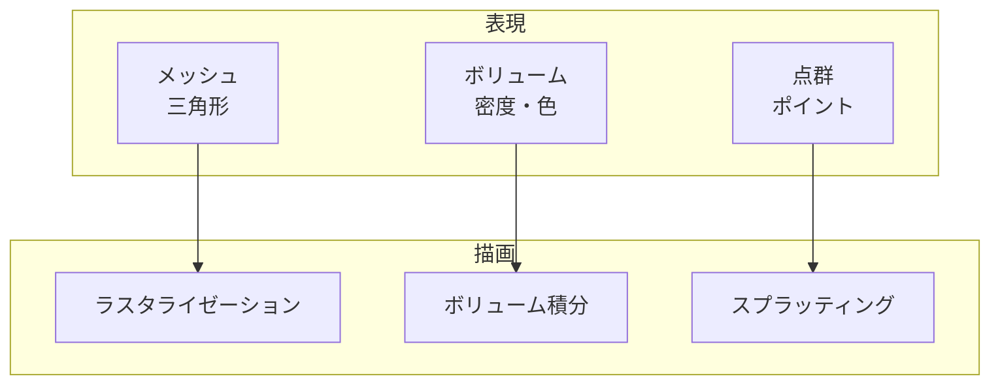

# 第4章 逆問題としての 3D ビジョン

Part I で数学・CG・自動微分の基礎を押さえました。Part II では、**なぜ微分可能ラスタライザが必要か** を動機づけます。本章では、3D ビジョンを「画像から 3D を復元する逆問題」として捉え、**微分可能レンダリング** が最適化と逆伝播で果たす役割、従来手法（レイマーチング・ニューラルレンダリング）との違い、そして既存の微分可能レンダラーの分類を整理します。次章（第 5 章）で、ラスタライザにおける「微分できない点」とその克服方法の概観に進みます。

---

## 4.1 順問題と逆問題

### 4.1.1 順問題：3D から画像へ

**順問題** とは、原因（3D シーン）が与えられたとき、結果（画像）を求める問題です。

$$
\text{シーン（形状・材質・照明・カメラ）} \xrightarrow{\;\; \mathcal{R} \;\;} \text{画像}
$$

ここで $\mathcal{R}$ は **レンダリング**（描画）の過程です。第 2 章で学んだパイプライン（MVP → ラスタライゼーション → シェーディング）は、この順問題を解くためのものです。レンダリングは、与えられたパラメータに対して **決定的** に画像を生成します。

### 4.1.2 逆問題：画像から 3D へ

**逆問題** とは、結果（観測された画像）から、原因（3D シーンやその一部）を推定する問題です。

$$
\text{画像（単一 or 複数視点）} \xrightarrow{\;\; \text{推定} \;\;} \text{形状・テクスチャ・照明・カメラ …}
$$

応用例としては、次のようなものがあります。

- **3D 再構成**: 写真や動画からメッシュ・テクスチャを復元する。
- **テクスチャ最適化**: 目標画像に合うように UV マッピングやテクスチャを更新する。
- **形状最適化**: シルエットやマルチビュー一貫性に合うように頂点位置を変える。
- **カメラ・照明推定**: 画像の見え方からカメラパラメータやライトを推定する。

これらは多くの場合、**最適化問題** として定式化されます。「レンダリング結果が観測画像に近いほどよい」という目的関数を設定し、シーンのパラメータを更新して目的関数を最小化（または最大化）します。

### 4.1.3 逆問題としての定式化

観測画像を $\mathbf{I}_{\text{obs}}$、レンダリング結果を $\mathbf{I}_{\text{render}}(\theta)$（$\theta$ は形状・テクスチャ・照明などのパラメータ）とすると、

$$
\theta^* = \arg\min_\theta \mathcal{L}\bigl( \mathbf{I}_{\text{render}}(\theta),\, \mathbf{I}_{\text{obs}} \bigr)
$$

という形になります。$\mathcal{L}$ は損失関数（例: L1, L2, 知覚損失）です。  
この最適化を **勾配ベース**（SGD, Adam など）で行うには、$\frac{\partial \mathcal{L}}{\partial \theta}$ が必要です。そのためには、**レンダリング** $\mathbf{I}_{\text{render}}(\theta)$ が $\theta$ について **微分可能** である必要があります。これが **微分可能レンダリング** の必要性の根拠です。

---

## 4.2 微分可能レンダリングの必要性（最適化・逆伝播）

### 4.2.1 勾配による最適化

勾配 $\frac{\partial \mathcal{L}}{\partial \theta}$ が計算できれば、次のような更新が可能です。

$$
\theta \leftarrow \theta - \eta \frac{\partial \mathcal{L}}{\partial \theta}
$$

学習率 $\eta$ やオプティマイザの詳細は省略しますが、**逆伝播** によって損失から各パラメータへの勾配が得られ、それに基づいて $\theta$ を更新できます。  
微分可能レンダリングでは、**レンダリング処理全体** を計算グラフの一部として扱い、損失から **頂点・テクスチャ・照明パラメータ** まで勾配が流れるようにします。

### 4.2.2 なぜ解析的勾配が望ましいか

勾配の求め方には、**数値微分** と **解析的（自動）微分** があります。

- **数値微分**: $\theta$ を少し動かして $\mathcal{L}$ の変化を測る。パラメータ数が多くなると計算コストが膨大で、精度も $\varepsilon$ に依存する。
- **解析的微分**: レンダリングの各ステップを微分可能にし、連鎖律で勾配を導く。一度実装すれば、パラメータ数に比例するコストで正確な勾配が得られる。

そのため、実用的な逆レンダリングでは **解析的（または自動微分可能な）レンダリング** がほぼ必須です。本教材で目指す「nvdiffrast 相当のライブラリ」は、この解析的勾配をラスタライゼーションまで含めて実装するものです。

### 4.2.3 逆伝播の経路

損失 $\mathcal{L}$ は多くの場合、**ピクセルごとの誤差** の和や、知覚損失などで定義されます。したがって、

$$
\frac{\partial \mathcal{L}}{\partial \theta} = \sum_{\text{pixel}} \frac{\partial \mathcal{L}}{\partial I_{\text{render}}^{(\text{pixel})}} \cdot \frac{\partial I_{\text{render}}^{(\text{pixel})}}{\partial \theta}
$$

のように、**ピクセルごとの損失の勾配** が、**ピクセル色から $\theta$ への勾配** を通じて $\theta$ に集約されます。  
レンダリングのうち、**ラスタライゼーション** は「どの頂点（三角形）がそのピクセルに寄与したか」を決める部分です。ここが離散的だと $\frac{\partial I}{\partial \theta}$ に「穴」が開くため、Part IV で学ぶ **ソフトラスタライゼーション** や **解析的勾配** でその穴を埋める必要があります。

---

## 4.3 従来手法との比較（レイマーチング・ニューラルレンダリング）

微分可能な 3D 表現・レンダリングには、ラスタライザ以外のアプローチもあります。ここでは代表的なものと、ラスタベース手法の位置づけを整理します。

### 4.3.1 レイマーチング（Ray Marching）

**レイマーチング** は、各ピクセルから発した光線（レイ）を進め、**符号付き距離関数（SDF）** などとの交差判定で表面を求める手法です。

- **長所**: 暗黙的な表現（SDF）と相性が良く、滑らかな形状が扱いやすい。ボリュームレンダリングとも組み合わせやすい。
- **短所**: レイと表面の **交差点** の計算は一般に微分可能だが、離散ステップで近似する場合は勾配が不安定になりがち。また、メッシュのような **明示的ジオメトリ** や、既存の 3D アセット（FBX, OBJ）をそのまま使う場合には、ラスタライザの方が自然です。

メッシュを主な入力とし、既存の CG パイプライン（UV, 法線, テクスチャ）と統合する場合は、**微分可能ラスタライザ** が適しています。

### 4.3.2 ニューラルレンダリング（NeRF など）

**NeRF** やその派生は、**ボリューム** としてシーンを表現し、レイに沿って色・密度を積分して画像を合成します。

- **長所**: ビュー依存効果や半透明・グロウを自然に扱える。写真から連続的な 3D 表現を学習できる。
- **短所**: メッシュ・UV・テクスチャという形で **編集可能なアセット** を直接得るわけではない。レンダリングコストが高く、リアルタイム化には追加の工夫（3D グリッド、小型 MLP など）が必要。

**メッシュ + テクスチャ** を出力し、既存の DCC ツールやゲームエンジンで編集・利用するワークフローでは、**微分可能ラスタライザ** でメッシュをレンダリングし、その勾配で形状・テクスチャを最適化するアプローチがよく使われます。

### 4.3.3 ラスタライザの立ち位置

| 観点 | レイマーチング / SDF | ニューラル（NeRF 等） | ラスタライザ（メッシュ） |
|------|----------------------|------------------------|----------------------------|
| 表現 | 暗黙（SDF 等） | ボリューム・MLP | 明示的メッシュ・UV・テクスチャ |
| 編集性 | 形状は編集しやすい | 編集は別途変換が必要 | DCC・ゲームエンジンとそのまま連携 |
| レンダリング速度 | レイ数・ステップに依存 | 重いことが多い | GPU ラスタライザで非常に速い |
| 逆問題 | 形状最適化と相性良い | 写真から学習 | 形状・テクスチャ・照明の逆最適化 |

本教材のゴールである **nvdiffrast 相当のライブラリ** は、この「メッシュ + ラスタライザ」の枠組みで、**解析的かつ効率的な勾配** を実現するものです。

---

## 4.4 既存の微分可能レンダラーの分類と比較

### 4.4.1 ラスタベース vs ボリュームベース vs ポイントベース

微分可能レンダリングの実装は、**ジオメトリの表現** と **描画の仕組み** によって大別できます。

- **ラスタベース**: 三角形メッシュをラスタライズする。OpenDR, Soft Rasterizer, DIB-R, **nvdiffrast** など。本教材の主役。
- **ボリュームベース**: レイに沿って密度・色を積分。NeRF, VolSDF, その他 NeRF 系。メッシュを直接出力しない。
- **ポイントベース**: 点群をスプラット（円盤・球）で描画。微分可能なポイントクラウドレンダリングなど。メッシュとは表現が異なる。

### 4.4.2 ラスタベース手法の代表例

| 手法 | 勾配の扱い | 特徴・用途 |
|------|------------|------------|
| **OpenDR** | 有限差分や解析的勾配の先駆け | 古典的。現代ではソフト／解析的勾配が主流。 |
| **Soft Rasterizer** | ソフトマックスでピクセル帰属を連続化 | 実装が比較的簡単。境界がぼやけがち。 |
| **DIB-R** | ソフトラスタ + 深度のソフト化 | 単一画像からの 3D 推定などで広く利用。 |
| **nvdiffrast** | 解析的勾配、rasterize / interpolate 分離 | 決定的で安定、高速。本教材の目標水準。 |

### 4.4.3 各手法の長所・短所・適用場面

**ラスタベース（メッシュ）**

- **長所**: 既存のアセット・パイプラインと相性が良い。高速。UV・法線・テクスチャをそのまま扱える。
- **短所**: ラスタライゼーション・深度テストの離散性をどう扱うかが設計の要。エッジ・境界の勾配は注意が必要。
- **適用場面**: テクスチャ最適化、メッシュ再構成・最適化、マルチビュー一貫性の学習、既存メッシュの逆レンダリング。

**ボリュームベース（NeRF 等）**

- **長所**: ビュー依存効果・半透明を自然に表現。写真からの連続的再構成に強い。
- **短所**: メッシュ出力は別途変換が必要。計算コストが高い。
- **適用場面**: 新規視点合成、写真からの 3D シーン表現、リッチな見た目のモデリング。

**ポイントベース**

- **長所**: 点群をそのまま描画。実装のバリエーションがある。
- **短所**: メッシュとは表現が違う。密度が高いとコスト・可視性の扱いが課題。
- **適用場面**: 点群の可視化・最適化、メッシュにしない 3D 表現。

本教材では **ラスタベース** に絞り、その中でも **解析的勾配** を実装して nvdiffrast に近い品質と安定性を目指す流れを、Part III 以降で掘り下げます。

---

## 4.5 まとめと次章への接続

- **順問題**: 3D シーン → レンダリング → 画像。逆問題: 画像（と prior）→ 推定 → 形状・テクスチャ・照明など。
- **逆問題の定式化**: レンダリング結果と観測の損失を最小化する最適化。そのために **微分可能レンダリング** と **解析的勾配** が重要。
- **従来手法**: レイマーチングは SDF と相性が良いがメッシュパイプラインとは別。ニューラルレンダリングは表現力が高いが編集可能なメッシュを直接は出さない。メッシュ＋ラスタライザは編集・連携・速度で有利。
- **分類**: ラスタベース（本教材の主役）・ボリュームベース・ポイントベース。それぞれ長所・短所・適用場面がある。

次章（第 5 章）では、**微分可能性の障壁** に焦点を当てます。ラスタライザのどこが離散的で微分できないか（ピクセル帰属・深度テスト・エッジ）、そして勾配の「穴」を埋めるアプローチ（ソフト化・解析的勾配）の概観を学び、Part III 以降の数学と実装への橋渡しをします。

---

*前: [第 3 章 深層学習と自動微分](../Part01/Chapter03.md) | 次: [第 5 章 微分可能性の障壁](Chapter05.md)*
