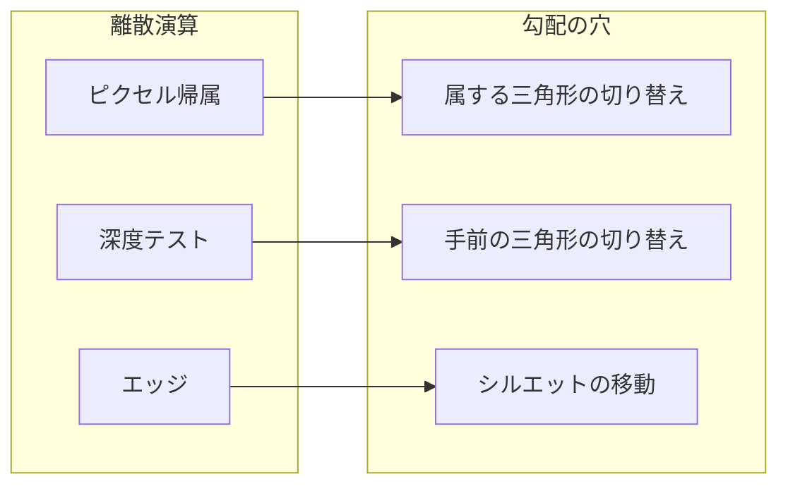

# 第5章 微分可能性の障壁

第4章で、逆問題の最適化には微分可能レンダリングが必要であることを学びました。しかし **ラスタライザ** には、そのままでは勾配が定義できない **離散演算** が含まれています。本章では、一般的に離散演算が微分を阻む理由（5.1）、ラスタライザ内の具体的な非微分点（5.2）、そしてそれらの「穴」を埋めるアプローチの概観（5.3）を整理します。Part III 以降で、それぞれを数学的・実装的にどう扱うかの土台になります。

---

## 5.1 離散演算が微分を阻む理由（if, argmax, ステップ関数）

### 5.1.1 微分可能であるとは

関数 $y = f(x)$ が $x$ で **微分可能** であるとは、その点で微分係数 $f'(x) = \lim_{h \to 0} \frac{f(x+h)-f(x)}{h}$ が有限の値として存在することです。**偏微分** も同様に、その変数以外を固定したときの変化率が有限で一意であることが求められます。  
逆伝播では、この「変化率」に上流の勾配を掛けて下流へ渡すため、**変化率が定義できない** と勾配が途切れます。

### 5.1.2 分岐（if）と不連続

プログラムの **if** は、条件が真か偽かで出力が切り替わるため、境界付近で **不連続** になります。

- 例: $f(x) = \mathbb{1}_{x \ge 0}$（ヘビサイド関数）は $x=0$ で不連続。$x>0$ では $f'(x)=0$、$x<0$ でも $f'(x)=0$ だが、$x=0$ では通常の意味での微分は定義できない。
- ラスタライザでは「ピクセルが三角形の内側か外側か」が if に相当し、境界（エッジ）で出力がジャンプする。

不連続な点では勾配を 0 とするか、サブグラディエントを定義するか、あるいは **連続な近似** に置き換えるか、のいずれかの設計が必要です。

### 5.1.3 argmax と選択の離散性

**argmax** は、複数の候補のうち「最大を取るもののインデックス」を返す演算です。

$$
k^* = \arg\max_k \; a_k
$$

$k^*$ は整数であり、$a_k$ を連続的に動かしても $k^*$ は **飛び飛びにしか変わらない** ため、$a_k$ に対する $\frac{\partial k^*}{\partial a_k}$ は通常の意味では定義できません。  
ラスタライザでは、「あるピクセルに複数の三角形が重なるとき、**どれが手前か**」を決める **深度テスト** が、実質的に argmax（手前の三角形の選択）に相当します。この「選択」が離散的であることが、深度バッファ経由の勾配を難しくします。

### 5.1.4 ステップ関数と閾値

**ステップ関数**（閾値で 0/1 が切り替わる関数）は、閾値の点で微分不可能です。

- 例: $\sigma(x) = 0$ if $x < 0$, $\sigma(x) = 1$ if $x \ge 0$。$x=0$ では傾きが「無限大」と解釈されるため、数値的にも逆伝播でも扱いづらい。
- 実務では **シグモイド** や **ソフトマックス** で滑らかに近似し、勾配を定義することが多い。

ラスタライザでは、「ピクセルが三角形に属するか」を 0/1 で表すとステップ関数になり、エッジ付近で勾配が 0 または未定義になります。**ソフトラスタライゼーション** では、この 0/1 をソフトマックスなどで連続化します。

### 5.1.5 まとめ：離散演算の共通点

| 演算 | 問題 | 勾配が流れない理由 |
|------|------|---------------------|
| if / 分岐 | 不連続 | 境界で微分が定義できない |
| argmax | 離散選択 | インデックスは整数、連続変化しない |
| ステップ関数 | 閾値でジャンプ | 閾値で微分不可能 |

これらを **連続近似** または **解析的な勾配の再定義** で扱うのが、微分可能ラスタライザの核心の一つです。

---

## 5.2 ラスタライザにおける非微分点（ピクセル帰属・深度テスト・エッジ）

第2章で学んだパイプラインを、**微分可能性** の観点から見直します。

### 5.2.1 ピクセル帰属（どの三角形がそのピクセルを覆うか）

各ピクセルについて、「どの三角形（または三角形のどの部分）がそのピクセルに寄与するか」を決めるのが **ピクセル帰属** です。

- **離散的な実装**: エッジ関数で内外判定し、内側なら 1、外側なら 0。境界は **0 か 1 の二値** なので、三角形の頂点を少し動かすと、境界付近のピクセルでは「突然属する／属さない」が切り替わる。
- **微分の問題**: 属する三角形が **切り替わる瞬間**、そのピクセルの色は別の三角形の属性にジャンプする。頂点位置に対する連続的な変化にならないため、$\frac{\partial (\text{色})}{\partial (\text{頂点})}$ が境界で定義できないか、0 になる。

したがって、**ピクセル帰属そのもの** が離散演算であり、そのままでは勾配が「穴」になります。

### 5.2.2 深度テスト（どの三角形が手前か）

複数の三角形が同じピクセルを覆う場合、**深度テスト** で手前のものだけを残します。

- **離散的な実装**: 深度値を比較し、手前なら描画・奥なら破棄。実質的に **argmax**（手前の三角形の選択）。
- **微分の問題**: どちらが手前かが **入れ替わる境界** では、描画される三角形が突然変わる。深度を少し変えただけで、ピクセルに寄与する三角形が変わるため、勾配が不連続または 0 になる。

ソフトラスタライザでは、深度を **ソフトマックス** で重み付けし、「手前の三角形ほど大きな重み」となるようにして連続化します。解析的勾配（nvdiffrast）では、**実際に描画されている三角形** についてのみ勾配を定義し、境界ではエッジ勾配を別途扱います。

### 5.2.3 エッジ（三角形の境界）

**エッジ** は、三角形と三角形の境目、あるいは三角形と背景の境目です。

- **幾何的な意味**: エッジ上では、隣り合うピクセルが「属する三角形」や「重心座標」が変わる。つまり **ピクセル帰属の境界** そのもの。
- **微分の問題**: エッジを横切ると、補間される属性（色・深度）が別の三角形の式に切り替わる。そのため、**エッジに垂直な方向** への頂点移動に対する勾配が、従来の「補間式の微分」だけでは捉えきれない。シルエット（輪郭）を変えるような頂点の動きに対して、特別な **シルエット勾配** を定義する必要がある。

nvdiffrast では、**境界ピクセル** を検出し、エッジに沿った勾配と、シルエットを動かす勾配を解析的に導出します。Part IV（11 章）で詳述します。

### 5.2.4 非微分点の対応関係

- **ピクセル帰属** → 属する三角形が変わる点で勾配が穴になる。  
- **深度テスト** → 手前が入れ替わる点で勾配が穴になる。  
- **エッジ** → シルエットを動かす頂点への勾配が、補間だけでは不足する。

---

## 5.3 勾配の「穴」を埋めるアプローチ概観

離散演算による勾配の穴を埋める代表的なアプローチを、Part III–IV で詳しく学ぶ前に概観します。

### 5.3.1 ソフト化（連続近似）

**ソフト化** は、離散的な判定を **連続な関数** で近似する方法です。

- **ピクセル帰属**: エッジ関数の 0/1 の代わりに、**シグモイド** や **ソフトマックス** で「だんだん属する」重みを付ける。すべての三角形（または近くの三角形）に、連続な重みで寄与させる。
- **深度テスト**: 深度に **ソフトマックス** を適用し、「手前の三角形ほど重みが大きい」連続な重みでブレンドする。
- **長所**: 実装が比較的容易。既存の autograd と組み合わせやすい。  
- **短所**: 境界がぼやける。重みの設計（温度パラメータなど）に依存し、勾配の大きさや安定性を調整する必要がある。

Soft Rasterizer や DIB-R はこの路線です。Part IV の第 10 章で定式化を学びます。

### 5.3.2 解析的勾配（決定的な勾配の定義）

**解析的勾配** は、離散演算を「そのまま微分する」のではなく、**見えている結果に基づいて、勾配を式で定義する** アプローチです。

- **考え方**: 順伝播では従来どおり離散的なラスタライゼーション・深度テストを行う。逆伝播では、「そのピクセルに実際に寄与した三角形と重心座標」を使って、**補間式の微分** で頂点・属性への勾配を計算する。エッジ付近では、**境界の移動**（シルエット勾配）を追加で考慮する。
- **長所**: 画像はシャープで、勾配は決定的で安定しやすい。nvdiffrast がこの路線。  
- **短所**: 実装は複雑。エッジ・境界ピクセルの検出と、その勾配の導出が必要。

Part IV の第 9 章（古典的アプローチ）と第 11 章（サブディビジョンと解析的勾配）で、数学と nvdiffrast の設計を学びます。

### 5.3.3 ハイブリッドと使い分け

- **ソフト化**: プロトタイプや、境界のシャープさより実装の簡単さを優先する場合。  
- **解析的**: 本格的な逆レンダリングや、nvdiffrast 相当を目指す場合。  
- 両者を **ハイブリッド** にすることも可能（例: 通常は解析的、深度のあいまいな部分だけソフト化）が、まずはどちらか一方をきちんと理解するのがおすすめです。

### 5.3.4 本教材での道のり

- 本章で **どこに穴があるか** を把握した。  
- Part III で **ラスタライゼーションの式**（重心座標・補間・パースペクティブ補正）とその微分を整理する。  
- Part IV で **ソフトラスタ** と **解析的勾配** の定式化を学ぶ。  
- Part V で実装し、Part VI で nvdiffrast レベルを目指す。

---

## 5.4 まとめと次章への接続

- **離散演算**: if / argmax / ステップ関数は、境界や選択の切り替えで微分が定義できないか 0 になる。  
- **ラスタライザの非微分点**: (1) ピクセル帰属（属する三角形の切り替え）、(2) 深度テスト（手前の切り替え）、(3) エッジ（シルエット勾配の不足）。  
- **穴を埋めるアプローチ**: **ソフト化**（連続近似）と **解析的勾配**（見えている結果に基づく勾配の式）。それぞれ長所・短所があり、本教材では両方を扱い、実装では解析的を目標とする。

Part II はここまでで、「なぜ微分可能ラスタライザか」と「何が障壁か」「どう埋めるか」の概観が揃いました。  
次章（第 6 章、Part III）からは **ラスタライゼーションの数学** に入り、三角形とスクリーン空間、エッジ関数、重心座標、深度・属性の補間式とその微分を厳密に扱います。これが、ソフト化でも解析的勾配でも共通して使う土台になります。

---

*前: [第 4 章 逆問題としての 3D ビジョン](Chapter04.md) | 次: [第 6 章 三角形とスクリーン空間](../Part03/Chapter06.md)*
