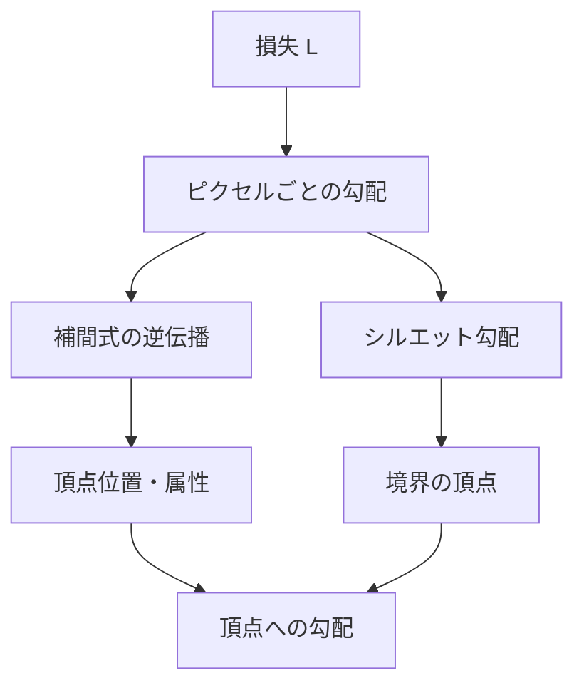

# 第11章 サブディビジョンと解析的勾配

第10章でソフトラスタライゼーションを学びました。本章では **解析的勾配** の路線を完成させます。三角形の細分割と勾配の流れ（11.1）、**nvdiffrast** の設計思想（11.2）、アンチエイリアシングと勾配の一貫性（11.3）、エッジ・頂点・面に沿った勾配の導出（11.4）、そして **シルエット勾配** の扱い（11.5）を扱います。Part V の実装と Part VI の nvdiffrast 解剖の理論的土台になる章です。

---

## 11.1 三角形の細分割による勾配の流れ

### 11.1.1 サブディビジョンの直観

**サブディビジョン**（細分割）の考え方は、次のようなものです。

- ピクセルが三角形の **内部** にあるとき、そのピクセルの色・深度は **補間式** で一意に決まる（第 6 章）。
- 補間式は頂点位置・属性の **微分可能な関数** なので、逆伝播では「そのピクセルに寄与した三角形」について、**補間式の偏微分** で頂点・属性への勾配が計算できる。
- **境界**（エッジ上や、ピクセルが三角形の外縁にまたがる場合）では、補間だけでは「シルエットが動く」ような頂点の変化を捉えきれないため、**シルエット勾配** を別途定義する。

つまり、「見えている三角形」については **補間の微分** で勾配を流し、**境界** については **面積やエッジの位置** の微分で勾配を補う、という二本立てです。

### 11.1.2 細分割と「どの三角形に属するか」

実装では、三角形を **細分割** するのではなく、**ラスタライザが出力した情報**（どのピクセルにどの三角形が描かれたか、重心座標は何か）をそのまま使います。

- 順伝播: 通常のラスタライゼーション・深度テストで、各ピクセルに **1 つの三角形**（手前のもの）とその **重心座標** が決まる。
- 逆伝播: その三角形についてだけ、**補間式の微分**（第 6 章）で頂点・属性への勾配を計算する。境界ピクセルでは、**シルエット勾配** を加える。

「細分割」という語は、**ピクセルごとに「属する面」が決まり、その面（三角形）のパラメータに対して勾配が流れる** という、幾何的な分割のイメージを表しています。nvdiffrast では、この「見えている面だけに勾配を流す」設計を、rasterize と interpolate の分離で明確にしています。

### 11.1.3 勾配の流れのまとめ

- **内部ピクセル**: 補間式の微分のみで頂点・属性に勾配が届く。
- **境界ピクセル**: 補間の勾配に加え、エッジの移動・面積の変化に対応するシルエット勾配を加算する。

---

## 11.2 nvdiffrast の設計思想（解析的・決定的勾配）

### 11.2.1 設計の原則

**nvdiffrast**（NVIDIA, 2020）は、微分可能ラスタライザとして次の原則で設計されています。

1. **決定的な順伝播**: 従来のラスタライゼーション・深度テストと同様に、各ピクセルに **一意に** 三角形と重心座標が決まる。ソフトな重みでブレンドしないため、画像はシャープである。
2. **解析的な逆伝播**: 逆伝播では、**そのピクセルに実際に描かれた三角形と重心座標** に基づいて、式で勾配を定義する。温度パラメータに依存せず、同じ入力に対して同じ勾配が得られる。
3. **rasterize と interpolate の分離**: 「どのピクセルにどの三角形が描かれるか」と「重心座標」を計算する **rasterize** と、「その情報を使って属性（色・深度・UV など）を補間する」**interpolate** を API 上分離する。これにより、幾何と属性の勾配が整理され、実装と最適化がしやすい（第 2 章 2.5.3、第 14 章 14.5）。

### 11.2.2 ソフトラスタとの対比

| 観点 | ソフトラスタ（第 10 章） | nvdiffrast（解析的） |
|------|---------------------------|------------------------|
| 順伝播 | 複数三角形を重みでブレンド | 手前の三角形 1 つを決定的に選択 |
| 逆伝播 | 重みの微分で全三角形に勾配 | 見えている三角形だけに補間の微分＋境界でシルエット |
| 境界 | 重みでなだらかに変化 | エッジを明示的に検出し、シルエット勾配を加算 |
| ハイパーパラメータ | 温度・スケールが必須 | 不要（式で一意） |

### 11.2.3 実装が複雑になる理由

解析的勾配では、次の処理が必要になります。

- **境界ピクセルの検出**: どのピクセルがエッジにまたがっているか（隣接ピクセルと属する三角形が異なる、または重心座標が閾値付近）の判定。
- **シルエット勾配の導出**: エッジとピクセル領域の重なり面積、またはエッジの位置が頂点の関数としてどう変わるかを微分する。
- **アンチエイリアシングとの整合**: 解析的 AA を使う場合、境界での描画と勾配の定義を同じ枠組みで扱う（11.3）。

その代わり、**決定的で再現性の高い勾配** が得られ、本格的な逆レンダリングや nvdiffrast 相当のライブラリの基盤になります。

---

## 11.3 アンチエイリアシングと勾配の一貫性（境界の扱いを先に）

### 11.3.1 境界を先に決める理由

解析的勾配では、**境界ピクセル** で何をするかを先に決めておくと、内部と境界の勾配の定義が矛盾しません。

- **順伝播**: 境界では、ピクセルと三角形の **重なり面積**（解析的 AA）で色や深度をブレンドするか、あるいは 1 つの三角形のみで描画するか、を決める。
- **逆伝播**: その **同じ定義** に基づいて、面積やエッジ位置の頂点に関する偏微分で勾配を計算する。

「見た目」と「勾配」を **同じ式** から導くことで、境界で勾配が飛んだり、逆伝播と順伝播が食い違ったりするのを防ぎます（第 7 章 7.3.3）。

### 11.3.2 解析的 AA と勾配

第 7 章で触れた **解析的アンチエイリアシング** では、ピクセルと三角形の **重なり面積** $A_{ij}$ を式で計算します。

- 順伝播: $A_{ij}$ に比例する重みで、三角形の色と背景をブレンドする。
- 逆伝播: $A_{ij}$ は頂点位置（スクリーン座標）の連続関数なので、$\frac{\partial A_{ij}}{\partial (\text{頂点})}$ を計算すれば、境界でも一貫した勾配が得られる。

nvdiffrast では、オプションでこのような解析的 AA を組み込み、境界の画質と勾配の一貫性を両立させています（Part VI 第 17 章）。

### 11.3.3 内部と境界の役割分担

- **内部ピクセル**: 補間式 $C = C(u, v, \text{属性})$ の微分のみ。第 6 章の式をそのまま使う。
- **境界ピクセル**: 補間の勾配に加え、**シルエット勾配**（エッジの移動・面積の変化）を加算。11.4–11.5 で導出の流れを扱う。

---

## 11.4 エッジ・頂点・面に沿った勾配の導出

### 11.4.1 面（三角形内部）に沿った勾配

ピクセルが三角形の **内部** にあり、その三角形だけが描画されているとき、出力（色・深度）は **補間式** で与えられます。

$$
C = C(u, v; \; \text{頂点属性}), \quad z = z(u, v; \; \text{深度}), \quad \text{など}
$$

$u$, $v$ は重心座標（第 6 章）。逆伝播では、上流から $\frac{\partial L}{\partial C}$, $\frac{\partial L}{\partial z}$ などが渡されるので、

$$
\frac{\partial L}{\partial u} = \frac{\partial L}{\partial C} \frac{\partial C}{\partial u} + \cdots, \quad \frac{\partial L}{\partial v} = \cdots
$$

とし、さらに **$u$, $v$ の頂点スクリーン座標に関する微分**（第 6 章 6.3.2）と、**スクリーン座標のクリップ空間に関する微分**（第 6 章 6.6.2–6.6.4）を連鎖律でつなげば、**頂点位置・頂点属性** への勾配が得られます。これが **面に沿った勾配** です。

### 11.4.2 エッジに沿った勾配

**エッジ** は、隣接する 2 頂点を結ぶ線分です。頂点を動かすと、エッジの **位置** が変わります。

- エッジ上のピクセルでは、属する三角形は 1 つに決まっているが、**エッジがピクセルを横切る** ような頂点の動きに対しては、補間式の微分だけでは「エッジが動いた分」の寄与が不足する。
- そこで、**エッジの位置**（またはピクセルと三角形の重なり面積）を頂点の関数とみなし、その偏微分を **エッジに沿った勾配** として、該当する 2 頂点に配分する。

具体的には、エッジ $\mathbf{p}_i \to \mathbf{p}_j$ のスクリーン座標が頂点の線形関数であることを使い、$\frac{\partial (\text{面積やカバレッジ})}{\partial \mathbf{p}_i}$, $\frac{\partial (\text{面積やカバレッジ})}{\partial \mathbf{p}_j}$ を計算します。詳細は実装編（Part V）と nvdiffrast の解剖（Part VI）で扱います。

### 11.4.3 頂点への集約

各ピクセルから流れてきた勾配は、**頂点** ごとに **加算** で蓄積されます。

- 1 つの頂点は複数の三角形・複数のエッジに属するため、複数ピクセル・複数経路から同じ頂点に勾配が届く。
- したがって、**加算**（accumulate）が正しい。nvdiffrast の API でも、頂点勾配の蓄積は加算で行う。

UV がつながっていないが位置が同じ頂点（共有頂点で UV が異なる）では、**位置** への勾配は 1 つにまとめ、**UV** への勾配は頂点ごとに持つ、といった設計になります（Part VI 17.6）。

---

## 11.5 シルエット勾配の扱い

### 11.5.1 シルエット勾配とは

**シルエット**（輪郭）は、オブジェクトの見えている境界線です。頂点を動かすと、シルエットの **位置** が変わり、それに応じて **どのピクセルがオブジェクトに属するか** が変わります。

- **補間式の微分** だけでは、「そのピクセルに描かれている三角形の属性がどう変わるか」は捉えられるが、「そのピクセルが突然この三角形に属するようになった／属さなくなった」という **归属の変化** は捉えられない。
- **シルエット勾配** は、**輪郭の移動** に対応する勾配である。境界ピクセルで、エッジがピクセル領域を横切る方向への頂点の変化に対して、損失がどう変わるかを式で定義する。

これにより、形状を変えてシルエットを目標に合わせるような最適化（例: シルエット損失）で、正しく勾配が流れます。

### 11.5.2 エッジ検出と境界ピクセルの特別扱い

**エッジ検出** の典型的な方法は次のとおりです。

- **隣接ピクセルとの比較**: 隣と **属する三角形 ID** が異なるピクセルを境界とする。
- **重心座標の閾値**: $u$, $v$, $1-u-v$ のいずれかが 0 に近い（またはエッジまでの距離がピクセル幅以下）ピクセルを境界付近とみなす。
- **深度の差**: 隣接ピクセルとの深度差が大きい場合にエッジとみなす（オクルージョンエッジ）。

**境界ピクセルの特別扱い** では、そのピクセルについて

1. 通常の **補間の逆伝播**（描画されている三角形の頂点・属性への勾配）を行う。
2. 加えて、**シルエット勾配** を計算し、該当するエッジの 2 頂点（および必要なら隣接面の頂点）に **加算** する。

シルエット勾配の大きさは、**ピクセルとエッジの重なり** や **損失のそのピクセルでの感度** に比例する形で定義します。nvdiffrast では、境界ピクセルでエッジとピクセル矩形の交差を解析的に求め、その面積（または長さ）の頂点に関する微分をシルエット勾配として使います。

### 11.5.3 nvdiffrast におけるシルエット勾配の役割

nvdiffrast では、シルエット勾配により次のことが実現されています。

- **輪郭を動かす学習**: シルエット損失（マスクとの一致）で形状を最適化するとき、輪郭付近の頂点に適切な勾配が届く。
- **境界での勾配の穴を埋める**: 補間の微分だけでは 0 になりがちな「エッジを横切る方向」に、シルエット勾配で非ゼロの勾配を供給する。
- **解析的 AA との整合**: 解析的 AA で境界の色・深度を面積に基づいてブレンドしている場合、その面積の微分がそのままシルエット勾配の計算に使える。

Part VI 第 17 章では、nvdiffrast のカーネル構成と、rasterize / interpolate / antialias の役割、およびシルエット勾配がどの段階で加算されるかを詳述します。

---

## 11.6 まとめと次章への接続

- **サブディビジョンと勾配**: 見えている三角形について補間式の微分で勾配を流し、境界ではシルエット勾配で補う。細分割は「ピクセルごとに属する面が決まる」という意味で使われる。
- **nvdiffrast の設計**: 決定的な順伝播、解析的な逆伝播、rasterize と interpolate の分離。ソフトラスタとの対比で一意性・再現性が特徴。
- **AA と勾配の一貫性**: 境界の描画（解析的 AA の面積など）と勾配の定義を同じ枠組みにし、境界を先に決めてから内部と整合させる。
- **エッジ・頂点・面の勾配**: 面は補間の微分、エッジはエッジ位置・面積の微分、頂点は複数経路からの加算で集約。
- **シルエット勾配**: 輪郭の移動に対応する勾配。エッジ検出と境界ピクセルの特別扱いで、補間の勾配に加算する。nvdiffrast では境界の画質と学習の両方に効く。

Part IV はここまでで、古典的アプローチ・ソフトラスタ・解析的勾配（nvdiffrast の設計）の理論が揃いました。  
次章（第 12 章、Part V）からは **実装編** に入り、退化三角形・背面・クリッピング、数値安定性、メモリと計算コストなど、スクラッチで微分可能ラスタライザを実装する際の考慮事項を学びます。

---

*前: [第 10 章 ソフトラスタライゼーション](Chapter10.md) | 次: [第 12 章 実装上の考慮事項](../Part05/Chapter12.md)*
