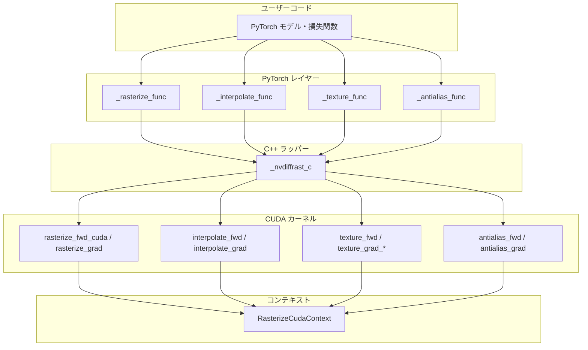
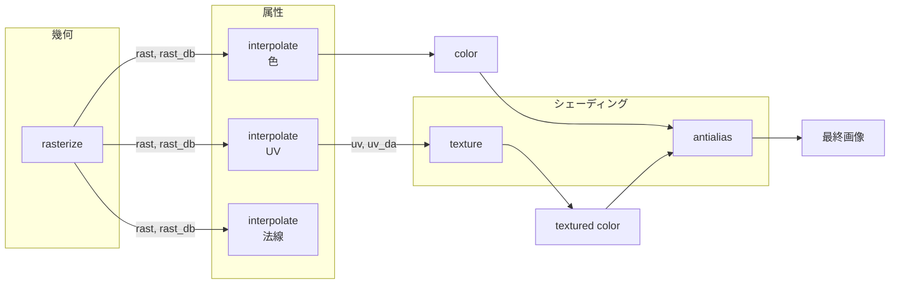
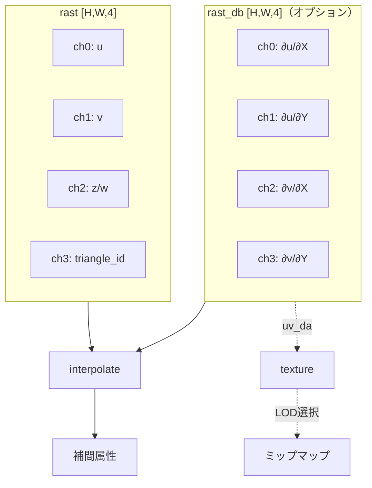
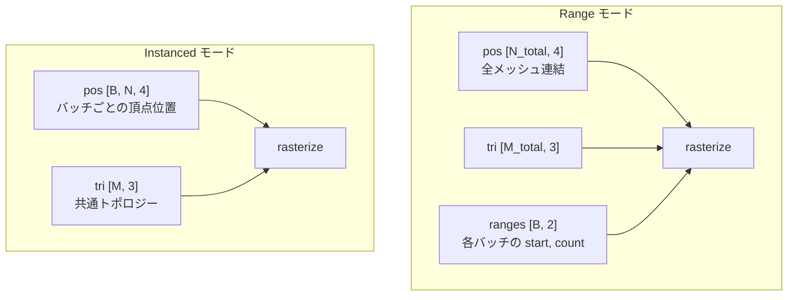
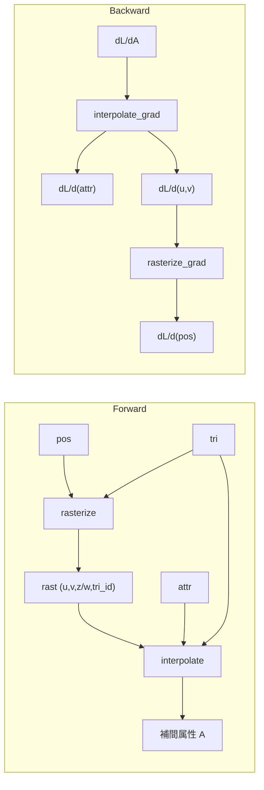
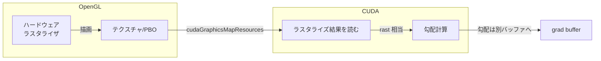
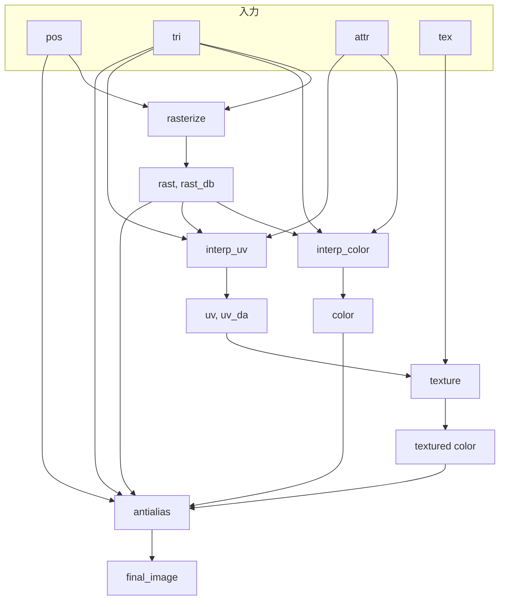
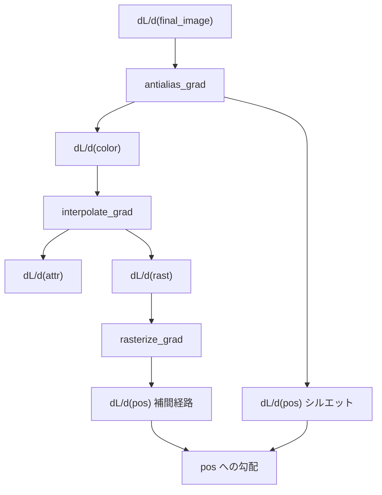

# 第17章 nvdiffrast の解剖

Part VI では **nvdiffrast レベル** を目指します。本章では **nvdiffrast**（NVIDIA, 2020）を解剖し、アーキテクチャと API 設計（17.1）、カーネル構成（17.2）、勾配計算の数式とコードの対応（17.3）、マルチ解像度・ミップマップとの関係（17.4）、エッジケース処理（17.5）、トポロジー参照の最適化（17.6）、そして OpenGL コンテキストと CUDA の相互運用（17.7）を扱います。第 14 章の Deferred Interpolation と第 11 章の解析的勾配が、nvdiffrast でどう形になっているかを具体的に押さえます。

---

## 17.1 アーキテクチャと API 設計（rasterize と interpolate の分離が最大の特徴）

### 17.1.0 全体アーキテクチャの階層構造

nvdiffrast は **モジュール化された微分可能レンダリングのプリミティブ** を提供する PyTorch ライブラリであり、redner、SoftRas、PyTorch3D などより高レベルなライブラリとは異なり、カメラモデル・ライティング・マテリアルは含まず、**グラフィックスパイプラインの中核ステップのみ** をカプセル化しています。

**階層構造** は次のとおりです。

1. **PyTorch レイヤー**: `torch.autograd.Function` を継承した `_rasterize_func`、`_interpolate_func`、`_antialias_func`、`_texture_func` など。forward と backward を定義し、勾配を自動微分に連携する。
2. **C++ ラッパー**: `_nvdiffrast_c` という PyTorch 拡張モジュール。Python と CUDA の橋渡しをし、テンソルの形状チェック・型変換を行う。
3. **CUDA カーネル**: 実際の演算を実行。`rasterize_fwd_cuda`、`rasterize_grad`、`rasterize_grad_db`、`interpolate_fwd`、`interpolate_grad`、`interpolate_grad_da`、`antialias_fwd`、`antialias_grad`、`texture_fwd`、`texture_grad_*` など。全演算とその勾配は CUDA で GPU アクセラレーションされている。
4. **コンテキスト管理**: `RasterizeCudaContext`（旧 `RasterizeGLContext` は非推奨）が GPU メモリや内部バッファを保持する。コンテキストは CUDA デバイスに紐づき、破棄時にリソースが解放される。

**設計哲学**: カメラ・ライティング・マテリアルをライブラリ内に持たず、**プリミティブだけを公開** することで、ユーザーが PyTorch 内で任意の高パフォーマンスグラフィックスパイプラインを組み立てられるようにしています。

**座標系とメモリレイアウト**: nvdiffrast は **OpenGL の慣習** に従います。射影後、クリップ空間の $z/w$ は視線方向に奥へ向かって増加する。**画像データのメモリ順序はボトムアップ**（行 0 が画像の下段）であり、一般的なスキャンライン順（上から下）とは逆。他ライブラリとの連携時は垂直フリップが必要な場合がある。2D テクスチャの UV 原点 $(0,0)$ は左下。

### 17.1.1 四つのプリミティブとパイプライン

nvdiffrast は **四つのプリミティブ** を提供します。

| プリミティブ | 役割 | 主な入出力 |
|-------------|------|------------|
| **rasterization** | 三角形ジオメトリをスクリーン空間に変換し、幾何バッファを生成 | 入力: `pos`, `tri`, `resolution` / 出力: `rast`, `rast_db` |
| **interpolation** | 頂点属性を画像空間へ転送 | 入力: `attr`, `rast`, `rast_db`, `tri` / 出力: 補間された属性画像 |
| **texturing** | フィルタ付きテクスチャサンプリング（ミップマップ対応） | 入力: `tex`, `uv`, `uv_da` / 出力: サンプリング結果 |
| **antialiasing** | シルエットエッジでの解析的アンチエイリアシング | 入力: `color`, `rast`, `pos`, `tri` / 出力: アンチエイリアス済み画像 |

典型的なパイプラインは **rasterize → interpolate → [ユーザーシェーディング] → texture（UV の場合）→ antialias** の順です。rasterize と interpolate の分離が、この設計の中心です。

### 17.1.2 二段階 API の意図

nvdiffrast の最大の特徴は、**rasterize** と **interpolate** を **別 API** に分けていることです。

- **rasterize(glctx, pos, tri, resolution, ...)**: 入力はクリップ空間の頂点 `pos` と面インデックス `tri`。出力は **幾何バッファ** — 各ピクセルについて、**三角形 ID**、**重心座標** $(u,v)$、**深度**（または $z/w$）など。**属性（色・UV・法線）は一切使わない**。
- **interpolate(attr, rast, rast_db, tri, ...)**: 入力は **頂点属性** `attr` と、rasterize の出力 `rast`（およびオプションで `rast_db`）、面インデックス `tri`。出力は、補間された属性の画像（色・法線・UV など）。ここで初めて属性が登場する。

この分離により、**幾何**（どのピクセルにどの三角形が描かれるか）と **属性**（そのピクセルでどんな色・法線になるか）が論理的に分かれ、実装・最適化・勾配の導出が整理されます（第 2 章 2.5.3、第 14 章 14.5）。

### 17.1.3 rast と rast_db のバッファフォーマット

rasterize は **2 つのテンソル** を返します。どちらも形状 `[minibatch, height, width, 4]` です。

**rast（メイン出力）** — 各チャネルの意味:

| チャネル | 内容 | 備考 |
|----------|------|------|
| 0 | $u$（重心座標） | 第 1 頂点は $(u,v)=(1,0)$ |
| 1 | $v$（重心座標） | 第 2 頂点は $(0,1)$、第 3 頂点は $(0,0)$ |
| 2 | $z/w$（正規化深度） | antialias での遮蔽判定に使用。頂点位置には勾配を伝播しない |
| 3 | `triangle_id` | 三角形インデックス +1。描画されていないピクセルは全チャネル 0 |

**rast_db（画像空間微分、オプション）** — `grad_db=True` のときに生成。重心座標の画像空間微分:

| チャネル | 内容 |
|----------|------|
| 0 | $\partial u/\partial X$ |
| 1 | $\partial u/\partial Y$ |
| 2 | $\partial v/\partial X$ |
| 3 | $\partial v/\partial Y$ |

ここで $(X,Y)$ はピクセル座標（単位はピクセル）。`rast_db` は interpolate に渡すことで **属性の画像空間微分**（例: $\partial (s,t)/\partial (X,Y)$）が計算でき、texture プリミティブでは **テクスチャフットプリント**（サンプリング密度）の推定に使われ、ミップマップの LOD 選択に寄与します。逆伝播では `rasterize_grad_db` が `rast_db` の勾配を `pos` に伝播させます。

### 17.1.4 利用パターン

典型的な使い方は次のとおりです。

1. **rasterize** を 1 回呼び、`rast` を保存する。
2. **interpolate** を、色用・法線用・UV 用など **属性の種類ごと** に呼ぶ。同じ `rast` を渡すので、ラスタライズは 1 回で済む。
3. 逆伝播では、**interpolate の backward** で「属性への勾配」と「$(u,v)$ への勾配」が得られ、**rasterize の backward** に $(u,v)$ の勾配を渡して頂点位置 `pos` への勾配を得る。

これが、G-buffer 的な「幾何を一度決めて、属性は後から」という設計の完成形です。

### 17.1.5 Range モードと Instanced モード（バッチ処理）

全プリミティブは **minibatch 軸** をサポートします。ジオメトリの与え方は次の 2 通りです。

- **Range モード**: 異なるメッシュをバッチ各要素に割り当てる。`pos` は `[num_vertices, 4]`、`tri` は `[num_triangles, 3]`。追加で **range テンソル** `[minibatch_size, 2]`（各行が `tri` への start と count）を渡し、どのメッシュをどのバッチに描くか指定する。`pos` と `attr` は全メッシュを連結した形状。
- **Instanced モード**: 同一メッシュを複数視点・複数変形で描く。`pos` は `[minibatch_size, num_vertices, 4]`、`tri` は `[num_triangles, 3]`。range テンソルは不要。`attr` は `[minibatch_size, num_vertices, num_attributes]` または `[1, num_vertices, num_attributes]`（ブロードキャスト可）。

同じメッシュを複数視点で描く場合は Instanced モードが効率的です。

### 17.1.6 バックエンド（CUDA が標準）

nvdiffrast は、ラスタライゼーションの **バックエンド** として **OpenGL**、**Vulkan**、または **CUDA のみ** を選べます。**現行の PyTorch 版では `RasterizeCudaContext` が標準** であり、旧 `RasterizeGLContext` は非推奨で、内部で CUDA コンテキストを使用しています。OpenGL/Vulkan を使う場合、既存の GPU ラスタライザ（ハードウェア）を利用し、その結果を CUDA と連携して勾配計算に使います（17.7）。CUDA のみのバックエンドでは、ラスタライゼーションから描画までをすべて CUDA で実装し、ディスプレイやウィンドウシステムに依存しないヘッドレスな環境でも動かせます。

---

## 17.2 カーネル構成（rasterize, interpolate, antialias, texture）

### 17.2.1 rasterize カーネルと内部 CUDA 呼び出し

**rasterize** は、クリップ空間の頂点と面から、**幾何バッファ** を生成する CUDA パイプラインです。

- **入力**: `pos` (N, 4) または `[minibatch, N, 4]`、`tri` (M, 3)、`resolution` (H, W)、`ranges`（range モード時）、`grad_db`（`rast_db` の勾配を `pos` に伝播するか）。
- **出力**: `(rast, rast_db)`。`rast` は 17.1.3 のフォーマット。`rast_db` は `grad_db=True` のときのみ意味を持つ。
- **内部 CUDA**: `_nvdiffrast_c.rasterize_fwd_cuda` で forward、`rasterize_grad` または `rasterize_grad_db` で backward。PyTorch の `_rasterize_func` が `ctx.save_for_backward(pos, tri, out)` で `pos`、`tri`、`rast` を保存し、backward で上流勾配 `dy`、`ddb` を受け取って `g_pos` を返す。
- **アルゴリズム**: 三角形並列またはタイルベースでピクセルを走査し、深度テストで手前の三角形を選び、その三角形の重心座標を書き込む。ポイントサンプルであり、各ピクセルは **1 つの表面点**（最も近い可視表面）に対応する。カバレッジは頂点の動きに対して連続ではなく、occlusion/visibility に関する勾配は **antialias** で生成される。

### 17.2.2 interpolate カーネル

**interpolate** は、頂点属性と `rast` から、**補間された属性画像** を生成します。

- **入力**: `attr`（頂点属性）、`rast`（rasterize の出力）、`tri`（面インデックス。三角形から頂点への参照に必要）、`rast_db`（オプション。属性の画像空間微分を計算する場合）、`diff_attrs`（オプション。微分を計算する属性インデックスのリスト、または `'all'`）。
- **出力**: `(out, out_da)`。`out` は補間された属性画像 `[minibatch, H, W, num_attributes]`。`out_da` は `rast_db` と `diff_attrs` が指定された場合、選択した属性の画像空間微分 `(dA/dX, dA/dY, ...)`。
- **内部 CUDA**: `diff_attrs` があるときは `interpolate_fwd_da` / `interpolate_grad_da`、ないときは `interpolate_fwd` / `interpolate_grad`。透視補正には `rast` の $z/w$ に相当する情報（$1/w$ の補間）が使われる。
- **勾配**: backward で `g_attr`、`g_rast`（および `g_rast_db`）を返す。`g_rast` は rasterize の backward に渡す $(u,v)$ の勾配に相当する。

### 17.2.3 texture カーネル

**texture** は、フィルタ付きテクスチャサンプリングを行います。2D テクスチャとキューブマップに対応。

- **入力**: `tex`、`uv`（補間された UV）、`uv_da`（オプション。UV の画像空間微分）、`mip_level_bias`（オプション）、`mip`（オプション。事前構築ミップスタック）、`filter_mode`（`'auto'` / `'nearest'` / `'linear'` / `'linear-mipmap-linear'` など）、`boundary_mode`。
- **出力**: サンプリング結果 `[minibatch, H, W, tex_channels]`。
- **ミップマップ**: `uv_da` があればテクスチャフットプリント（サンプリング密度）を推定し、LOD を選択。`linear-mipmap-linear` が最高品質。内部でミップスタックを構築するか、`texture_construct_mip` で事前構築したものを渡せる。
- **勾配**: `texture_grad_linear`、`texture_grad_linear_mipmap_linear` などで `tex` と `uv` への勾配を計算。

### 17.2.4 antialias カーネル

**antialias** は、パイプライン末端で適用する **解析的アンチエイリアシング** です。

- **入力**: `color`（補間・テクスチャリング済み画像）、`rast`、`pos`、`tri`。オプションで `topology_hash`（`antialias_construct_topology_hash(tri)` で事前構築）、`pos_gradient_boost`（頂点勾配のスケール）。
- **処理**: シルエットエッジ（背景に対するエッジ、および 2 面のうち 1 面が背後に折りたたまれるエッジ）で、ピクセルと三角形の **重なり面積** を局所近似し、色をブレンドする。
- **勾配**: `antialias_grad` が `color` と `pos` への勾配を返す。**occlusion/visibility に関する頂点勾配** はここで初めて発生する。rasterize はポイントサンプルでカバレッジが連続でないため、antialias がシルエット勾配を担う。
- **注意**: シルエット判定は `tri` の頂点インデックスに依存する。同一頂点が複数三角形で異なるインデックスになっていると、常にシルエットと誤判定され、性能・勾配が悪化する。

### 17.2.5 Depth Peeler（複数深度レイヤー）

**DepthPeeler** は、複数の深度レイヤーを順次ラスタライズするコンテキストマネージャです。半透明や A-buffer 的な描画に使う。

- `DepthPeeler(glctx, pos, tri, resolution, ...)` でコンテキストを作成し、`with` 内で `rasterize_next_layer()` を呼ぶたびに、**それまでに報告された表面点を除外** した次のレイヤーをラスタライズする。
- 内部では `peeling_idx` をインクリメントし、`_rasterize_func.apply(..., peeling_idx)` に渡して、既に描画した三角形をマスクする。

---

## 17.3 勾配計算の数式とコードの対応

### 17.3.1 補間の forward と backward

第 6 章の透視補正付き補間では、

$$
\frac{1}{w} = \sum_k \frac{\lambda_k}{w_k}, \quad \frac{A}{w} = \sum_k \frac{\lambda_k A_k}{w_k}, \quad A = \frac{A/w}{1/w}
$$

でした。nvdiffrast の interpolate カーネルは、この式をそのまま実装しています。backward では、

- 上流の $\frac{\partial L}{\partial A}$ から $\frac{\partial L}{\partial (A/w)}$, $\frac{\partial L}{\partial (1/w)}$ を計算（第 6 章 6.6.3）。
- それらから $\frac{\partial L}{\partial \lambda_k}$, $\frac{\partial L}{\partial w_k}$, $\frac{\partial L}{\partial A_k}$ を計算し、$\lambda_k$ は重心座標 $(u,v)$ に対応するので、**rast に対する勾配**（$(u,v)$ の勾配）と **attr に対する勾配** に分かれる。

コード上では、各ピクセルで「どの三角形か」「$(u,v)$ は何か」「$1/w$ は何か」が `rast` に格納されているため、その情報を読んで上記の式を適用するだけです。

### 17.3.2 重心座標から pos への backward

rasterize の backward では、**ピクセルごとの $(u,v)$ の勾配** を受け取り、**頂点のクリップ座標 `pos`** への勾配を計算します。

- $(u,v)$ は頂点の **スクリーン座標**（2D）の関数（第 6 章 6.3.2）。スクリーン座標は NDC（$x_c/w_c$, $y_c/w_c$）の線形写像なので、**$w$ 除算の backward**（第 6 章 6.6.2）で NDC の勾配からクリップ座標の勾配を得る。
- 複数ピクセルから同じ頂点に勾配が流れるため、**加算** で蓄積する。CUDA では、複数スレッドが同じ頂点に書き込むため **アトミック加算** を使う。

数式は第 6 章・第 11 章で導出済みなので、nvdiffrast のコードはそれを **ピクセル並列または三角形並列** で実装したものと対応しています。

### 17.3.3 シルエット勾配のコード上の位置づけ

境界ピクセルでは、**補間の勾配** に加えて **シルエット勾配**（エッジの移動・面積の変化に対応する勾配）が必要です。nvdiffrast では、**rasterize の backward** は interpolate から受け取った $(u,v)$ の勾配を `pos` に変換するだけであり、**occlusion/visibility に関する勾配は発生しない**（ポイントサンプルではカバレッジが離散的だから）。**antialias の backward**（`antialias_grad`）が、シルエットエッジでの重なり面積の微分として `pos` への勾配を返す。つまり、`pos` への勾配は **rasterize の backward**（補間経路）と **antialias の backward**（シルエット経路）の両方から集約される。第 11 章 11.5 の式は antialias の枠組みに対応している。

---

## 17.4 マルチ解像度・ミップマップとの関係

### 17.4.1 解像度の指定

nvdiffrast の rasterize には **resolution** を渡します。同じメッシュ・同じカメラで、解像度だけを変えて呼ぶと、低解像度では粗い画像・高解像度では細かい画像が得られます。学習では、**マルチ解像度** で段階的に解像度を上げるスケジュールが使われることがあり、nvdiffrast は 1 回の呼び出しで 1 つの解像度を指定するため、訓練ループ内で resolution を変えればよいです。

### 17.4.2 ミップマップとの関係

テクスチャに **ミップマップ** を使う場合、**LOD**（Level of Detail）は通常「ピクセルがテクスチャ空間でカバーする範囲」から決まります。nvdiffrast 自体はラスタライザなので、ミップマップの選択は **interpolate の後**、テクスチャサンプリングの段階（ユーザー側または別モジュール）で行います。nvdiffrast が出力するのは「どのピクセルにどの UV が補間されたか」までで、その UV を使ってテクスチャをサンプリングする際に、LOD を固定するかミップマップを選ぶかは、第 8 章・第 16 章の設計に従います。マルチ解像度レンダリング（解像度を変えた複数回の rasterize）と、テクスチャのミップマップは別の概念ですが、どちらも「スケールに応じた品質とコストの調整」という点で関連しています。

---

## 17.5 nvdiffrast のエッジケース処理

### 17.5.1 具体的なバグ回避パターン

- **退化三角形**: 面積が 0 に近い三角形は、rasterize の前または内部でスキップする。除算の分母が 0 にならないようガードする（第 12 章）。
- **背面**: カリングするかどうかをオプションで切り替え。カリングする場合は、その面には勾配を流さない。
- **クリッピング**: 視錐台の外に出た三角形や、クリップで分割された三角形を正しく扱う。nvdiffrast はクリッピングを実装しており、クリップで生成された頂点にも属性と勾配が按分される。
- **エッジ上のピクセル**: ピクセル中心がちょうどエッジ上にある場合、浮動小数点の誤差で「内」「外」が振れることがある。**閾値**（$\varepsilon$）で「エッジの少し内側」を内側とみなす、または **一貫した tie-break**（例: 左閉右開）を決めておく（第 18 章 18.6）。

### 17.5.2 数値安定性のための工夫

- **$1/w$ と除算**: $w$ が 0 に近い場合のガード。補間では $1/w$ を扱うため、$w$ が十分大きい（奥すぎる）場合もオーバーフローに注意する。
- **重心座標**: $u$, $v$ が $[0,1]$ の外に少しはみ出した場合のクリップ。はみ出しは浮動小数点誤差で起こり得る。
- **勾配のクリッピング**: 逆伝播で得た勾配が異常に大きい場合、ノルムでクリップするオプションがある。学習の安定化に有効なことがある。

これらは、自作でも同様のガードを入れておくと、エッジケースでのクラッシュや NaN を防げます。

---

## 17.6 トポロジー参照の最適化

### 17.6.1 頂点インデックスの効率的な扱い（隣接情報の事前計算、重複頂点）

メッシュでは、**1 つの幾何頂点** が複数の **属性頂点**（UV や法線が異なる）に対応することがあります。OBJ の `f v1/vt1/vn1 v2/vt2/vn2 ...` では、位置インデックス・UV インデックス・法線インデックスが別々です。nvdiffrast では、内部で **頂点を展開** し、各面で「位置・UV・法線」の組を 1 頂点として扱う形式にすることが多いです。そのうえで、

- **隣接情報**: どの頂点が同じ位置を共有しているか、どのエッジがどの面に属するか、を事前に計算しておくと、シルエット勾配の配分や、位置勾配のマージが効率化できる。
- **重複頂点**: 「位置は同じだが UV が違う」頂点が複数ある場合、**位置** への勾配は 1 つにまとめ、その位置を参照する全頂点に **同じ勾配を加算** する必要がある（下記 accumulate_grad）。

### 17.6.2 「UV はつながっていないが位置は同じ頂点」の勾配のマージ（accumulate_grad の挙動）

**位置** は共有しているが **UV**（や法線）は面ごとに異なる頂点が複数あるとき、逆伝播では次のようにします。

- **属性（UV・法線）への勾配**: 各頂点（面ごとの頂点）に、その頂点が寄与したピクセルからの勾配を **そのまま** 加算する。
- **位置への勾配**: 同じ **幾何位置** を共有するすべての頂点に、それぞれから流れてきた「位置の勾配」を **合算** してから、その位置に 1 つだけ勾配を渡す。つまり、位置は 1 つだが、複数の「論理頂点」から勾配が集まるので、**加算でマージ** する。

nvdiffrast の API や内部では、この「位置で勾配をマージする」処理が **accumulate_grad** やそれに相当する名前で表現されています。ユーザーが「頂点位置」として 1 本のバッファだけを渡している場合は、内部で展開された頂点の位置勾配を、共有位置ごとに加算してからそのバッファに書き戻しています。自作で同様のメッシュ（位置共有・UV 非共有）を扱う場合、第 16 章 16.1.3 で触れた「位置の共有グループ」を作り、backward でグループごとに勾配を加算する実装が対応します。

---

## 17.7 OpenGL コンテキストと CUDA の相互運用（Interop）

### 17.7.1 nvdiffrast が OpenGL / Vulkan を使う場合の理由

nvdiffrast は、ラスタライゼーションを **ハードウェア**（OpenGL や Vulkan のラスタライザ）に任せるオプションを提供しています。理由は次のとおりです。

- **速度**: GPU の固定機能ラスタライザは非常に最適化されているため、CUDA でラスタライザを自前実装するより速い場合がある。
- **互換性**: 既存の OpenGL/Vulkan パイプラインと組み合わせやすい。ただし、**勾配計算** は依然として CUDA で行う必要があるため、OpenGL で描画した結果（フレームバッファ・深度バッファなど）を **CUDA から読む** 必要がある。

そのために、**CUDA-OpenGL Interop**（または CUDA-Vulkan）で、OpenGL のバッファを CUDA から参照し、読み書きできるようにします。

### 17.7.2 CUDA Graphics Resource Mapping の仕組み

**CUDA-OpenGL Interop** では、OpenGL のバッファ（フレームバッファに使うテクスチャや PBO）を **CUDA のリソース** として登録します。

1. OpenGL でテクスチャまたはバッファオブジェクトを作成する。
2. `cudaGraphicsGLRegisterImage` や `cudaGraphicsGLRegisterBuffer` で、そのオブジェクトを CUDA に登録する。
3. 描画前に `cudaGraphicsMapResources` でマップし、`cudaGraphicsSubResourceGetMappedArray` などで CUDA 側のポインタを取得する。
4. CUDA カーネルでそのポインタ経由で読み書きする。
5. `cudaGraphicsUnmapResources` でアンマップする。

これにより、OpenGL でラスタライズした結果を CUDA で読み、逆伝播の入力（どのピクセルに何が描かれたか）として使えます。勾配計算は CUDA で行い、結果をまた OpenGL のバッファに書き戻す必要は通常なく、勾配は別の CUDA バッファに書きます。

### 17.7.3 ヘッドレスレンダリング（EGL）のセットアップ

**ヘッドレス** では、ディスプレイやウィンドウを開かずに OpenGL コンテキストを作成します。**EGL** を使うと、Linux などで「仮想のディスプレイ」に対して OpenGL コンテキストを立て、オフスクリーンでレンダリングできます。

- **EGL の流れ**: `eglGetDisplay` → `eglInitialize` → `eglChooseConfig` → `eglCreateContext` → `eglCreatePbufferSurface`（オフスクリーン用）→ `eglMakeCurrent`。これで、ウィンドウなしで OpenGL が使える。
- **nvdiffrast**: EGL でコンテキストを作成し、そのコンテキストを nvdiffrast の `glctx` として渡す。サーバー環境や Docker 内でも、ディスプレイがなくても nvdiffrast を動かせる。

EGL の初期化失敗や、ドライバ・環境変数（`__EGL_VENDOR_LIBRARY_FILENAMES` など）の設定が、実運用では障壁になることがあります。公式ドキュメントや nvdiffrast のサンプルを参照し、環境に合わせて設定します。

---

## 17.8 パイプライン全体のデータフロー（図解）

nvdiffrast の典型的な forward と backward の流れを整理します。

### 17.8.1 Forward パス

### 17.8.2 Backward パス

- **rasterize** は 1 回だけ呼び、`rast` を複数の **interpolate** に渡す。
- **interpolate** は属性ごとに呼び、`rast_db` を渡すと画像空間微分が計算される。テクスチャを使う場合は **texture** が `uv_da` で LOD を決める。
- **antialias** は最後に適用し、シルエット勾配を `pos` に加える。antialias を省いた場合、頂点位置に対する occlusion/visibility の勾配は得られない。

---

## 17.9 まとめと次章への接続

- **アーキテクチャ階層**: PyTorch autograd → C++ ラッパー（`_nvdiffrast_c`）→ CUDA カーネル。`RasterizeCudaContext` がリソースを管理。四つのプリミティブ（rasterization, interpolation, texturing, antialiasing）がモジュール化されている。
- **API 設計**: rasterize（幾何のみ）と interpolate（属性の補間）の分離が中心。同じ rast で複数種類の属性を補間でき、勾配の導出も整理される。`rast` は $(u,v,z/w,\mathrm{tri\_id})$、`rast_db` は重心座標の画像空間微分。
- **カーネル**: rasterize / interpolate / texture / antialias の役割と、それぞれの forward/backward の対応。interpolate は `tri` を必要とする。antialias が occlusion/visibility の勾配を担う。
- **勾配**: 第 6 章・第 11 章の数式がそのままコードに対応。補間の backward → $(u,v)$ の勾配 → rasterize の backward → pos の勾配。シルエット勾配は antialias で境界に加算。
- **Range/Instanced モード**: バッチ処理の 2 通りの与え方。ミップマップと画像空間微分（`rast_db`, `uv_da`）でテクスチャの LOD 選択。
- **マルチ解像度**: resolution の指定。ミップマップは texture プリミティブ内で扱う。
- **エッジケース**: 退化・背面・クリッピング・エッジ上の閾値・数値安定性。自作でも同様のガードを推奨。
- **トポロジー**: 頂点の展開、隣接情報、位置共有頂点の勾配マージ（accumulate_grad の考え方）。antialias は頂点インデックスの一貫性に依存する。
- **Interop**: OpenGL/Vulkan を使う場合の CUDA Graphics Resource のマップ、EGL によるヘッドレス。現行版は CUDA バックエンドが標準。

次章（第 18 章）では **性能と堅牢性** を扱い、メモリレイアウト・大きなメッシュ・高解像度へのスケール、エッジケースの扱い、デバッグと可視化、マルチ GPU、そして浮動小数点の精度問題と ε の扱いを学びます。nvdiffrast レベルを維持するための実務的な知見がまとまります。

---

*前: [第 16 章 本格的なパイプライン](../Part05/Chapter16.md) | 次: [第 18 章 性能と堅牢性](Chapter18.md)*
