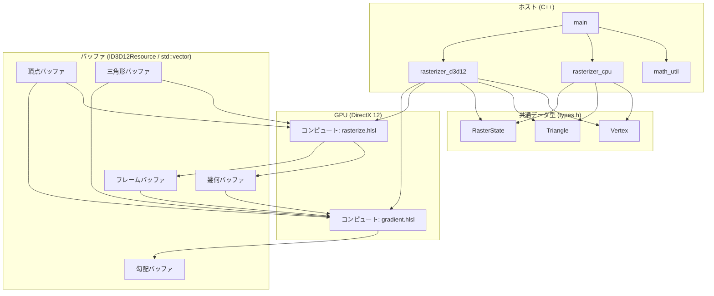
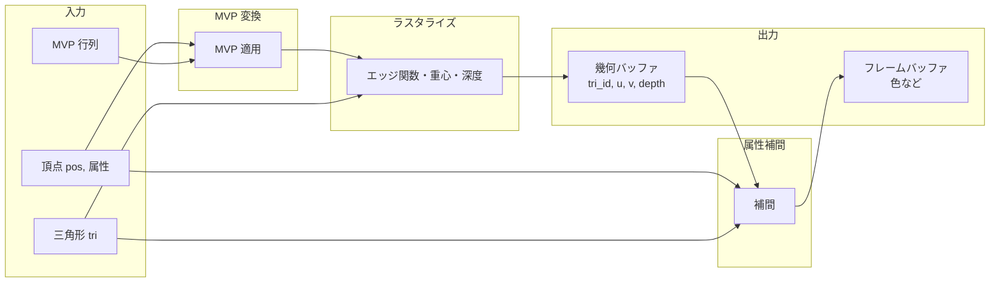
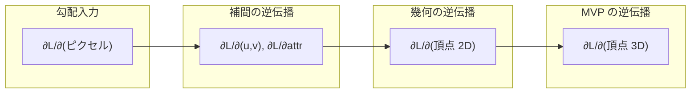
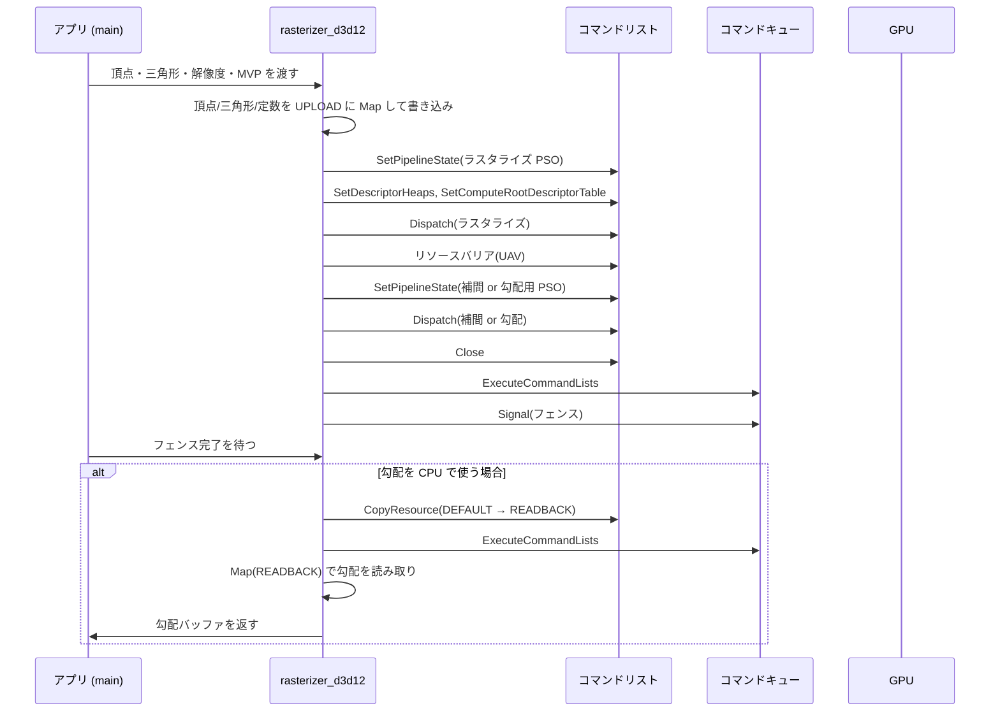

# 第22章 技術選定とアーキテクチャ

Part IX では **フルスクラッチ** で微分可能ラスタライザを実装します。既存の深層学習フレームワークや CUDA には依存せず、**DirectX 12 / Windows / C++** を採用し、**CMake + vcpkg** でビルドとパッケージ管理を行います。本章では技術選定の理由（22.1）、プロジェクト構成と vcpkg（22.2）、データフローとアーキテクチャ図・シーケンス図・I/F 定義・データ構造定義（22.3）、CPU/GPU 境界とバッファレイアウト（22.4）を固定します。

---

## 22.1 採用スタックの理由（DirectX 12：Windows ネイティブ・コンピュートシェーダー・HLSL/DXIL）

### 22.1.1 なぜ DirectX 12 か

- **Windows ネイティブ**: 想定プラットフォームを Windows に限定するため、OS 標準のグラフィックススタックと相性が良い。Windows SDK 一式で開発できる。
- **コンピュートシェーダー**: 微分可能ラスタライザはコンピュートが中心であり、**コンピュートパイプライン** で全てを書く。DirectX 12 はコンピュートシェーダーを第一級でサポートする。
- **低レベル制御**: バッファ・デスクリプタ・コマンドリストを明示的に管理でき、フルスクラッチ実装に向いている。
- **CUDA 非依存**: 逆伝播をシェーダーでそのまま実装する方針のため、DL フレームワークや CUDA に依存しない。

### 22.1.2 コンピュートシェーダーと HLSL / DXIL

- **HLSL**: シェーダーは HLSL で記述し、`[numthreads(X,Y,Z)]` と `SV_DispatchThreadID` でスレッドを扱う。
- **DXIL**: HLSL は **DXC**（DirectX Shader Compiler）で **DXIL** にコンパイルする。DXC は **vcpkg** の `directx-dxc` で導入する（22.2）。
- **言語**: ホスト側は **C++**。同一アーキテクチャは **Rust** でも実装可能である。

---

## 22.2 プロジェクト構成（CMake + vcpkg、Windows SDK、最小依存）

本教材では **Visual Studio は使わず**、**CMake** をビルドシステム、**vcpkg** をパッケージマネージャとして用いる。

### 22.2.1 ディレクトリ構成

```
project/
  CMakeLists.txt              # トップレベル、vcpkg ツールチェーン指定
  vcpkg.json                  # 依存ポートの宣言（manifest モード）
  src/
    main.cpp                  # エントリポイント、ウィンドウ・デバイス初期化
    rasterizer_cpu.cpp
    rasterizer_cpu.h          # CPU ラスタライザ公開 I/F（22.3.5 で定義）
    rasterizer_d3d12.cpp
    rasterizer_d3d12.h        # D3D12 ラスタライザ公開 I/F
    math_util.cpp             # MVP 変換など
    math_util.h               # 行列・ベクトル API（Eigen を用いた実装）
    types.h                   # 共通データ構造定義（22.3.6 と一致）
  shaders/
    rasterize.hlsl            # ラスタライズコンピュートシェーダー
    gradient.hlsl             # 勾配コンピュートシェーダー
  build/                      # ビルド出力（out-of-source）
```

- **shaders/** の HLSL は CMake で DXC を呼び出し、ビルド時に DXIL（`.cso` またはバイナリ）にコンパイルする。
- **types.h** には、22.3.6 で定める **データ構造定義**（頂点・三角形・幾何バッファ要素など）を C++ で宣言し、CPU/GPU で同一レイアウトを守る。

### 22.2.2 パッケージ管理：vcpkg

**vcpkg** を manifest モードで使い、依存を `vcpkg.json` に明示する。

**vcpkg.json**（プロジェクトルート）:

```json
{
  "name": "diff-rasterizer",
  "version": "0.1.0",
  "description": "Differentiable rasterizer full scratch (Part IX)",
  "dependencies": [
    "directx-dxc",
    "eigen3"
  ],
  "builtin-baseline": "latest"
}
```

- **directx-dxc**: HLSL → DXIL のコンパイルに使用。CMake では `find_package(directx-dxc CONFIG REQUIRED)` で DXC ツールとライブラリを取得する。
- **eigen3**: 行列・ベクトル演算に使用する。`find_package(Eigen3 CONFIG REQUIRED)` で取得し、`math_util` の実装で MVP 変換等に用いる（22.3.5）。
- DirectX 12 の API（`d3d12.h`, `dxgi1_6.h`）とライブラリ（`d3d12.lib`, `dxgi.lib`）は **Windows SDK** に含まれるため、vcpkg のポートは不要。CMake で Windows SDK を検出すればよい。

**ビルド手順（Windows、PowerShell または cmd）**:

```bash
# vcpkg をクローン（未導入の場合）
git clone https://github.com/microsoft/vcpkg.git
.\vcpkg\bootstrap-vcpkg.bat

# プロジェクトのビルド
mkdir build
cd build
cmake .. -DCMAKE_TOOLCHAIN_FILE=[vcpkg のパス]/scripts/buildsystems/vcpkg.cmake -G "Ninja" -DCMAKE_BUILD_TYPE=Release
cmake --build .
```

- ジェネレータは **Ninja** を推奨する（MSVC クロームは `-G "Ninja" -DCMAKE_C_COMPILER=cl -DCMAKE_CXX_COMPILER=cl` で指定可能）。Visual Studio の IDE は使わない。
- 必要に応じて `VCPKG_ROOT` を環境変数で設定し、`CMAKE_TOOLCHAIN_FILE=$env:VCPKG_ROOT/scripts/buildsystems/vcpkg.cmake` のように渡す。

**CMakeLists.txt（最小例）**:

```cmake
cmake_minimum_required(VERSION 3.16)
project(diff-rasterizer LANGUAGES CXX)

set(CMAKE_CXX_STANDARD 17)

find_package(Eigen3 CONFIG REQUIRED)
find_package(directx-dxc CONFIG REQUIRED)

add_executable(diff_rasterizer_main
  src/main.cpp
  src/math_util.cpp
  src/rasterizer_cpu.cpp
  src/rasterizer_d3d12.cpp
)
target_include_directories(diff_rasterizer_main PRIVATE ${CMAKE_SOURCE_DIR}/src)
target_link_libraries(diff_rasterizer_main PRIVATE
  Eigen3::Eigen
  Microsoft::DirectXShaderCompiler
)
# Windows SDK の d3d12.lib, dxgi.lib は MSVC 環境で自動リンクされる場合がある。
# 明示する場合: target_link_libraries(diff_rasterizer_main PRIVATE d3d12 dxgi)
```

- HLSL のオフラインコンパイル（DXC で .hlsl → .cso）は、`add_custom_command` でビルド時に実行し、生成したバイナリをアプリから読み込む。具体的なコマンド例は第 24 章 24.5 で述べる。

### 22.2.3 依存関係の最小化

- **グラフィックス**: DirectX 12（Windows SDK）と vcpkg の **directx-dxc** のみ。OpenGL / Vulkan / 高レベルフレームワークは使わない。
- **数学**: **Eigen**（vcpkg の `eigen3`）を用いる。行列演算・MVP 変換は Eigen の `Eigen::Matrix4f`、`Eigen::Vector4f` 等で実装する。**自動微分ライブラリ（autograd 等）は使わない** — 微分可能レンダリングそのものは行い、勾配は第 6 章・第 11 章の解析的導出に従って **手で実装** する（解析的微分）。
- **ウィンドウ**: `CreateWindowEx` と `WM_PAINT` で十分。ヘッドレスでファイル出力のみの場合はウィンドウなしでもよい。

---

## 22.3 データフロー設計とアーキテクチャ

### 22.3.1 モジュール構成図（全体アーキテクチャ図）

次の図は、フルスクラッチ実装の **モジュール構成** と **データの流れ** の関係を表す。ホスト側モジュール（main, math_util, rasterizer_cpu, rasterizer_d3d12）、共通データ型（types.h）、GPU シェーダー、バッファの依存関係を示す。



- **ホスト**: `main` が `math_util` で MVP を計算し、`rasterizer_cpu` または `rasterizer_d3d12` を呼び出す。両者は **types.h** で定義した共通のデータ型（Vertex, Triangle, RasterState 等）を共有する。
- **GPU**: D3D12 のコンピュートシェーダー `rasterize.hlsl` と `gradient.hlsl` が、22.3.6 で定めるレイアウトのバッファを読み書きする。
- **バッファ**: 頂点・三角形は入力、幾何・フレーム・勾配はラスタライズ／勾配パスで更新される（22.4）。

### 22.3.2 データフロー図（順方向・逆方向）

**順方向**（頂点 → 画像）のデータの流れを次の図で示す。



**逆方向**（勾配）の流れは次のとおりである。



- 順方向: 入力（頂点・三角形・MVP）→ MVP 変換 → ラスタライズ → 幾何バッファ → 属性補間 → フレームバッファ。
- 逆方向: フレームバッファへの勾配 → 補間の逆伝播 → 重心・頂点属性への勾配 → 幾何（エッジ・面積）の逆伝播 → スクリーン空間頂点への勾配 → MVP の逆伝播 → 頂点位置への勾配。

### 22.3.3 シーケンス図（ホスト–GPU の 1 フレーム）

GPU パス（D3D12）における、1 フレーム分の **ホストとデバイス** のやりとりをシーケンス図で示す。



- ホストは `rasterizer_d3d12` の公開 API（22.3.5）を呼ぶ。内部で UPLOAD への書き込み、ディスパッチ、フェンス待ちを行う。
- 勾配を CPU に読み戻す場合は、DEFAULT → READBACK の `CopyResource` の後に `Map` で取得する。

### 22.3.4 各ステージの入出力（まとめ）

| ステージ       | 入力                           | 出力                                           |
|----------------|--------------------------------|------------------------------------------------|
| MVP 変換       | 頂点位置、MVP 行列             | クリップ空間／NDC／スクリーン座標の頂点         |
| ラスタライズ   | スクリーン座標の三角形、解像度 | 幾何バッファ（三角形 ID、$(u,v)$、深度）        |
| 属性補間       | 幾何バッファ、頂点属性         | フレームバッファ（色・UV・法線など）           |
| 勾配（逆方向） | フレームバッファへの勾配       | 頂点位置・属性への勾配（勾配バッファに蓄積）   |

「ラスタライズ → 幾何バッファ → 補間」の二段階に分ける設計とする（nvdiffrast と同様。第 14 章 14.5、第 17 章参照）。

### 22.3.5 I/F 定義（モジュール境界と公開 API）

ここでは、ホスト側 C++ の **モジュール境界** と **公開 API** を定義する。シェーダー（HLSL）の入出力は 22.3.6 のデータ構造および 22.4 のデスクリプタレイアウトと一致させる。

#### モジュール一覧

| モジュール           | 役割                                         | 公開ヘッダ   |
|----------------------|----------------------------------------------|--------------|
| **math_util**        | MVP 変換、行列・ベクトル演算                 | math_util.h  |
| **rasterizer_cpu**   | CPU ラスタライズ・属性補間・勾配の手実装     | rasterizer_cpu.h |
| **rasterizer_d3d12** | D3D12 デバイス/キュー/バッファ管理、ディスパッチ | rasterizer_d3d12.h |
| **types**            | 共通データ型（頂点・三角形・幾何要素等）     | types.h      |

#### math_util.h の公開 API（抜粋）

行列演算は **Eigen**（vcpkg の `eigen3`）を用いて実装する。Eigen の 4x4 行列は **列優先** であり、HLSL の `float4x4` および D3D12 の定数バッファレイアウトと一致する。

```cpp
#include <Eigen/Dense>  // 実装内で使用。必要に応じて API で Eigen 型を返すか、float* で受け渡す。

// 4x4 行列（列優先）。内部で Eigen::Matrix4f を用いて計算する
void multiply_m4_m4(float* out_4x4, const float* A_4x4, const float* B_4x4);
void multiply_m4_v4(float* out_4, const float* M_4x4, const float* v_4);

// モデル・ビュー・射影を適用し、クリップ空間の頂点を出力。入力は model-space の pos (x,y,z,1)
void apply_mvp(float* clip_pos, const float* pos, const float* model_view_proj_4x4);

// NDC → スクリーン座標（ピクセル中心）。解像度 (width, height) を渡す
void ndc_to_screen(float* screen_xy, const float* ndc_xy, int width, int height);

// オプション: Eigen 型を直接受け取り、float[] に書き出す（定数バッファ用）
void matrix4f_to_float(const Eigen::Matrix4f& M, float* out_16);
```

- 実装は **math_util.cpp** に置き、Eigen の `Eigen::Matrix4f`、`Eigen::Vector4f` 等で演算する。行列レイアウト（列優先）は Eigen のデフォルトであり、HLSL の `float4x4` と一致する（22.3.6）。

#### rasterizer_cpu.h の公開 API

```cpp
#include "types.h"

// 順方向: 頂点・三角形・解像度・MVP を入力とし、幾何バッファとフレームバッファを出力する。
// バッファは呼び出し側が確保し、ポインタを渡す。サイズは解像度から一意に決まる。
void rasterizer_cpu_forward(
    const Vertex*      vertices,    // 頂点配列（位置・属性）
    const uint32_t*     indices,     // 三角形インデックス (i0, i1, i2) × num_triangles
    int                 num_vertices,
    int                 num_triangles,
    const float*        model_view_proj_4x4,
    int                 width,
    int                 height,
    GeometryBuffer*    out_geometry,   // 出力: 幾何バッファ (width*height 要素)
    FrameBuffer*       out_frame       // 出力: フレームバッファ (width*height 要素)
);

// 逆方向: フレームバッファへの勾配を入力とし、頂点位置・属性への勾配を蓄積する。
// vertex_grad は呼び出し側でゼロ初期化し、本関数で加算する。
void rasterizer_cpu_backward(
    const Vertex*         vertices,
    const uint32_t*        indices,
    int                    num_vertices,
    int                    num_triangles,
    const GeometryBuffer*  geometry,      // 順方向で得た幾何バッファ
    const FrameBuffer*     frame,
    const float*           dL_d_frame,     // フレームバッファの勾配 (width*height*channels)
    int                    width,
    int                    height,
    VertexGrad*            vertex_grad     // 出力（加算）: 頂点ごとの勾配
);
```

- **Vertex**, **GeometryBuffer**, **FrameBuffer**, **VertexGrad** は **types.h** で定義する（22.3.6）。

#### rasterizer_d3d12.h の公開 API

```cpp
#include "types.h"

struct RasterizerD3D12;  // 不透明型。デバイス・キュー・PSO・バッファを保持。

// 作成・破棄。device, command_queue は外部で作成して渡すか、内部で作成する設計のどちらでもよい。
RasterizerD3D12* rasterizer_d3d12_create(int width, int height);
void             rasterizer_d3d12_destroy(RasterizerD3D12* r);

// 順方向: 頂点・三角形を GPU にアップロードし、ラスタライズ＋補間をディスパッチする。
// 完了は内部でフェンス待ちで同期する。out_geometry, out_frame は GPU 上のバッファのビューを表すか、
// 読み戻し用に CPU 側バッファを渡すかは設計による（本 I/F は「同期後、結果が GPU 上に存在する」を前提）。
void rasterizer_d3d12_forward(
    RasterizerD3D12*     r,
    const Vertex*       vertices,
    const uint32_t*     indices,
    int                 num_vertices,
    int                 num_triangles,
    const float*        model_view_proj_4x4,
    GeometryBuffer*     out_geometry,   // CPU に読み戻す場合はここに書き込む
    FrameBuffer*        out_frame
);

// 逆方向: フレームバッファへの勾配 dL_d_frame を渡し、勾配コンピュートをディスパッチする。
// vertex_grad は GPU 上で蓄積され、必要なら読み戻し用バッファにコピーして返す。
void rasterizer_d3d12_backward(
    RasterizerD3D12*     r,
    const float*        dL_d_frame,
    VertexGrad*         vertex_grad     // 出力（加算）。読み戻す場合は CPU 側バッファを渡す
);
```

- 実際の D3D12 ハンドル（ID3D12Device*, ID3D12Resource* 等）は **RasterizerD3D12** 内に隠蔽する。I/F は「同じ types.h の型」を渡すことで、CPU 実装と API を揃える。

#### シェーダー（HLSL）の I/F

- **rasterize.hlsl**: 定数バッファ（MVP、解像度、頂点数・三角形数）、頂点 SRV、三角形 SRV、幾何バッファ UAV、フレームバッファ UAV をバインドする。エントリポイントは `main`（CS の `[numthreads(nx,ny,1)]`）。
- **gradient.hlsl**: 定数バッファ、頂点 SRV、三角形 SRV、幾何バッファ SRV、フレームバッファ SRV、勾配バッファ UAV をバインドする。勾配は頂点ごとにアトミック加算するか、別パスでリダクションする。

レジスタ割り当て（b0, t0, t1, u0, u1, u2 等）は 22.4.3 のデスクリプタレイアウトと一致させる。

### 22.3.6 データ構造定義

CPU と GPU で **同一のメモリレイアウト** を守るため、以下を **types.h** および HLSL 側で同じ並び・型で定義する。

#### 頂点（Vertex）

- **役割**: 1 頂点の位置と属性。
- **C++（types.h）**:

```cpp
struct Vertex {
    float position[3];   // x, y, z (model space)
    float _pad1;
    float color[3];      // R, G, B
    float _pad2;
    float uv[2];         // u, v
    float _pad3[2];
    float normal[3];     // nx, ny, nz
    float _pad4;
};
// サイズ: 16 + 16 + 16 + 16 = 64 バイト（16 バイトアライン）
```

- **HLSL**: `struct Vertex { float3 position; float pad1; float3 color; float pad2; float2 uv; float2 pad3; float3 normal; float pad4; };` を **StructuredBuffer&lt;Vertex&gt;** で読み、**バイトオフセット 0** でバッファをビューする。

#### 三角形インデックス（Triangle）

- **役割**: 1 面の 3 頂点インデックス。
- **C++**:

```cpp
// インデックスは uint32_t の配列として連続で保持: [i0,i1,i2, i0,i1,i2, ...]
// 1 三角形あたり 3 要素。三角形数 num_triangles に対して indices の長さは 3 * num_triangles。
```

- **HLSL**: `StructuredBuffer<uint> indices` で、3 つずつ読む（三角形 k の頂点は `indices[3*k+0/1/2]`）。

#### 幾何バッファの 1 要素（GeometryBuffer の 1 ピクセル）

- **役割**: 各ピクセルに「どの三角形か」「重心座標 $(u,v)$」「深度」を格納する。
- **C++**:

```cpp
struct GeometryPixel {
    float u;           // 重心座標 (offset 0)
    float v;           // 重心座標 (offset 4)
    float depth;       // 正規化深度 z/w など (offset 8)
    uint32_t tri_id;   // 三角形 ID（0 = 背景）(offset 12)
};
// サイズ: 16 バイト
```

- **HLSL**: `struct GeometryPixel { float u; float v; float depth; uint tri_id; };` を **RWStructuredBuffer&lt;GeometryPixel&gt;**（または RWTexture2D で 4 チャネル）で扱う。ピクセル (x,y) のインデックスは `y * width + x`（行優先）で統一する。

#### フレームバッファの 1 ピクセル（FrameBuffer の 1 ピクセル）

- **役割**: 補間された色（および必要なら UV・法線）。
- **C++**:

```cpp
struct FramePixel {
    float color[3];   // R, G, B
    float alpha;     // 使用する場合
};
// サイズ: 16 バイト
```

- **HLSL**: 同じレイアウトの **RWStructuredBuffer&lt;FramePixel&gt;** または **RWTexture2D&lt;float4&gt;**。解像度 `width*height` 要素。

#### 勾配バッファ（頂点ごとの勾配）

- **役割**: 各頂点に対する損失の勾配を蓄積する。
- **C++**:

```cpp
struct VertexGrad {
    float d_position[3];  // ∂L/∂pos
    float _pad1;
    float d_color[3];
    float _pad2;
    float d_uv[2];
    float _pad3[2];
    float d_normal[3];
    float _pad4;
};
// レイアウトは Vertex と同サイズ・同アライン。num_vertices 要素。
```

- **HLSL**: **RWStructuredBuffer&lt;VertexGrad&gt;** で書き、複数ピクセルから同一頂点に勾配が流れる場合は **InterlockedAdd** で float をアトミック加算するか、別リダクションパスを用意する（float のアトミック加算は D3D12 では工夫が必要。実装詳細は第 24 章）。

#### 定数バッファ（1 フレーム分）

- **役割**: MVP 行列、解像度、頂点数・三角形数など。
- **C++**: 列優先 4x4 行列（64 バイト）+ width, height, num_vertices, num_triangles 等。D3D12 では 256 バイトアライン。Eigen の `Eigen::Matrix4f` は列優先なので、`matrix4f_to_float(M, ptr)` でそのまま定数バッファに書き出せる。
- **HLSL**: `cbuffer Constants { float4x4 model_view_proj; uint2 resolution; uint num_vertices; uint num_triangles; };`

**型エイリアス（types.h で定義）**:

```cpp
using GeometryBuffer = GeometryPixel*;   // または std::vector<GeometryPixel>
using FrameBuffer    = FramePixel*;     // または std::vector<FramePixel>
```

- 要素数はそれぞれ `width * height`。GPU では同じ要素型の **ID3D12Resource**（StructuredBuffer）を対応させる。

#### 勾配入力 dL_d_frame の形式

逆方向の入力「フレームバッファへの勾配」は、**フレームバッファと同じレイアウト** で渡す。

- **レイアウト**: 行優先。ピクセル `(x, y)`（`0 ≤ x < width`, `0 ≤ y < height`）の勾配は、連続 4 float（R, G, B, alpha に対応）で格納する。インデックスは `(y * width + x) * 4`。
- **チャネル数**: 4（FramePixel の color[3] + alpha に対応）。`rasterizer_cpu_backward` / `rasterizer_d3d12_backward` の `dL_d_frame` は `float*` で、長さ `width * height * 4`。
- **提供元**: アプリケーション側で、損失関数 $L$ をフレームバッファの各ピクセル・各チャネルで偏微分した値（$\partial L / \partial R_{xy}$ 等）を計算し、このバッファに書き込んでから backward を呼ぶ。

#### 座標系・NDC の約束

全モジュールで一貫させるため、次の仕様に固定する。

| 項目 | 仕様 |
|------|------|
| **NDC の範囲** | $x, y, z \in [-1, 1]$（DirectX 慣習）。射影行列はこの範囲に合わせる。 |
| **スクリーン座標** | ピクセル中心を整数 $(0, 0)$ ～ $(width-1, height-1)$ に対応させる。NDC の $x=-1$ が $x=0$、$x=1$ が $x=width-1$ になるように線形写像する（22.3.5 の `ndc_to_screen`）。 |
| **Y の向き** | NDC の $y$ は上向き正（$y=1$ が画面上端）とする。スクリーン座標の $y=0$ を上端、$y=height-1$ を下端とする（行 $y$ のメモリオフセットは `y * width`）。 |
| **深度** | クリップ空間の $z/w$ を正規化深度として用いる。大きいほど奥。可視性は「深度が小さい（手前）ものを勝たせる」とする（第 24 章で深度テストの詳細を実装）。 |

- これにより、CPU と GPU で同じピクセルに同じ三角形が描かれ、比較可能になる（第 25 章）。

---

## 22.4 CPU/GPU 境界とバッファレイアウト（ID3D12Resource、デスクリプタヒープ、ホスト/デバイス転送）

### 22.4.1 必要なバッファ一覧

| バッファ名（論理） | 要素型／用途                     | ヒープ           | 備考 |
|--------------------|----------------------------------|------------------|------|
| 頂点バッファ       | Vertex（22.3.6）                 | UPLOAD           | SRV、読み取り専用 |
| 三角形バッファ    | uint32_t × 3 × num_triangles     | UPLOAD           | SRV |
| 定数バッファ       | 上記 Constants                   | UPLOAD           | CBV、256 バイトアライン |
| 幾何バッファ       | GeometryPixel × width × height   | DEFAULT          | UAV（ラスタライズで書く）、SRV（勾配で読む） |
| フレームバッファ   | FramePixel × width × height      | DEFAULT          | UAV、SRV（勾配で読む） |
| 勾配バッファ       | VertexGrad × num_vertices        | DEFAULT          | UAV、読み戻し時は READBACK にコピー |

### 22.4.2 ID3D12Resource とヒープタイプ

- **D3D12_HEAP_TYPE_UPLOAD**: 頂点・三角形・定数。ホストから `Map` で書き、GPU は読み取りのみ。
- **D3D12_HEAP_TYPE_DEFAULT**: 幾何・フレーム・勾配。GPU が読み書き。ホストが読む場合は **READBACK** へ `CopyResource`。
- **D3D12_HEAP_TYPE_READBACK**: 勾配をホストに読み戻す用のコピー先。

### 22.4.3 デスクリプタヒープのレイアウト

コンピュートパイプラインごとに、次の **スロット** を固定する。

**ラスタライズ PSO**:

| スロット | 種類 | 内容           | HLSL register |
|----------|------|----------------|----------------|
| 0        | CBV  | 定数バッファ   | b0             |
| 1        | SRV  | 頂点バッファ   | t0             |
| 2        | SRV  | 三角形バッファ | t1             |
| 3        | UAV  | 幾何バッファ   | u0             |
| 4        | UAV  | フレームバッファ | u1           |

**勾配 PSO**:

| スロット | 種類 | 内容             | HLSL register |
|----------|------|------------------|----------------|
| 0        | CBV  | 定数バッファ     | b0             |
| 1        | SRV  | 頂点バッファ     | t0             |
| 2        | SRV  | 三角形バッファ   | t1             |
| 3        | SRV  | 幾何バッファ     | t2             |
| 4        | SRV  | フレームバッファ | t3             |
| 5        | UAV  | 勾配バッファ     | u0             |

- デスクリプタヒープは **D3D12_DESCRIPTOR_HEAP_TYPE_CBV_SRV_UAV** で 1 本用意し、上記の並びで CBV/SRV/UAV を作成する。ルートシグネチャは「デスクリプタテーブル 1 つ」で、このヒープの先頭オフセットとデスクリプタ数を指定する。

### 22.4.4 ホストとデバイス間の転送

- **アップロード**: 頂点・三角形・定数を UPLOAD リソースに `Map` で書き、ディスパッチ前に `SetComputeRootDescriptorTable` でデスクリプタを設定する。
- **読み戻し**: 勾配を CPU で使う場合、DEFAULT の勾配バッファを READBACK リソースに `CopyResource` し、フェンス完了後に `Map` で読む。
- **同期**: 各フレームでフェンスを Signal し、ホストは Wait してから次のアップロードまたは読み戻しを行う。

---

## 22.5 本章の位置づけと実装に必要な情報の所在

### 本章で必要十分に定めているもの

第 22 章は **設計仕様** として、次を一意に定めている。これに従えば、第 23 章（CPU）と第 24 章（GPU）で矛盾なく実装できる。

- **技術選定**: DirectX 12 / Windows / C++、CMake + vcpkg、Eigen、DXC。
- **モジュール構成とデータフロー**: 図と表で固定。
- **I/F 定義**: math_util、rasterizer_cpu、rasterizer_d3d12 の公開 API とシェーダーのバインディング。
- **データ構造定義**: Vertex、GeometryPixel、FramePixel、VertexGrad、定数バッファのバイトレイアウトと C++/HLSL の対応。
- **座標系・NDC・勾配入力**: 22.3.6 の「座標系・NDC の約束」「勾配入力 dL_d_frame の形式」で固定。
- **バッファとデスクリプタ**: ヒープ種別、スロット割り当て、ホスト/デバイス転送。

### 実装時に他章を参照するもの

**微分可能ラスタライザをフルスクラッチで作成する** には、本章の設計に加え、次の **他章** で述べる **数式・アルゴリズム・コード** が必要である。

| 必要な情報 | 所在 |
|------------|------|
| エッジ関数・重心座標・深度の式とその微分 | 第 6 章 |
| 解析的勾配の導出（逆伝播の式） | 第 11 章 |
| 退化三角形・数値安定性・クリッピング | 第 12 章 |
| CPU でのラスタライズ・補間・逆伝播の実装 | 第 23 章 |
| D3D12 の初期化・コンピュートシェーダー・HLSL コード | 第 24 章 |
| ビルド（CMake で DXC を呼ぶ方法など） | 第 24 章 24.5 |
| 数値勾配との一致確認・可視化・ベンチマーク | 第 25 章 |

- **結論**: 第 22 章だけでは **実装は完了しない**。第 22 章は「何を・どの I/F で・どのデータ形式で作るか」を必要十分に決めており、**第 6・11・12・23・24・25 章と組み合わせることで**、微分可能レンダリングライブラリをフルスクラッチで作成できる。

---

## 22.6 Part IX のスコープと今後の拡張（テクスチャ・AA・マルチ解像度・シルエット勾配）

テクスチャサンプリング・アンチエイリアシング・マルチ解像度・シルエット勾配は、**微分可能レンダリングの本質から離れた「あればよいオプション」ではない**。それぞれ、画質・勾配の正しさ・実用性に直結する。本 Part IX の「最小実装」では **あえてスコープに含めず**、まずラスタライズ＋補間＋解析的勾配までを固めるが、**実用レベルの微分可能レンダラを目指すなら、いずれも実装すべき機能** である。

### 各機能の役割と「本質性」

| 機能 | 役割 | 本質性（なぜ重要か） |
|------|------|----------------------|
| **テクスチャサンプリング** | UV からテクスチャを読んで色を決める。逆伝播では「どのピクセルにどの UV が写るか」の勾配と「テクスチャのどの位置を読むか」の勾配が必要。 | テクスチャ付きメッシュの逆最適化（テクスチャ推定・形状＋テクスチャの同時最適化）では **必須**。本教材では第 8 章で微分可能サンプリングを扱う。 |
| **アンチエイリアシング** | エッジのジャギーを抑え、境界を滑らかにする。解析的 AA では「ピクセルと三角形の重なり面積」の勾配も定義する。 | 境界での **勾配の一貫性**（順伝播と逆伝播が同じ境界の定義に基づく）に直結。第 7 章・第 11 章で扱う。nvdiffrast も AA をオプションで提供する。 |
| **マルチ解像度** | 解像度を変えてレンダリングし、粗い解像度で形状を大まかに、細かい解像度でディテールを最適化する。 | 大規模な形状最適化で **収束と計算コスト** を両立させるために有効。実務ではよく使う。 |
| **シルエット勾配** | 境界（エッジ）にまたがるピクセルで、「エッジが動く」ことによる損失の変化を頂点位置に伝える勾配。第 11 章で導出。 | 形状最適化で **輪郭（シルエット）が変わる** ような変化に勾配を流すために **本質的**。内部の補間勾配だけでは、境界の頂点に正しい勾配が届かない場合がある。 |

したがって、「これらは実装しなくてもよい」のではなく、**「最小構成でまずパイプラインを完成させ、そのうえで順に追加する」** という段階的なスコープの切り方である。

### Part IX での扱いと拡張の推奨順序

- **現時点の Part IX（章 22～25）**: 頂点色のみの補間、AA なし、単一解像度、シルエット勾配なし（内部の補間勾配のみ）で、ラスタライズ→補間→逆伝播までを一通り実装・検証する。
- **拡張の推奨順序**:
  1. **シルエット勾配**（第 11 章 11.4–11.5）: 境界ピクセルの検出と、エッジ・面積の頂点に関する偏微分の実装。形状最適化の品質に直結するため、**最優先で追加することを推奨**する。
  2. **テクスチャサンプリング**（第 8 章）: UV 補間の出力に対してテクスチャをサンプリングするパスと、その逆伝播（UV とテクスチャ座標の勾配）。テクスチャ付きメッシュを扱うなら次に追加する。
  3. **アンチエイリアシング**（第 7 章）: 解析的 AA またはマルチサンプルと、境界での勾配の一貫した定義。画質と勾配の整合性のため。
  4. **マルチ解像度**: 解像度を引数で切り替え、コーストゥファインなどの最適化フローで利用する。必要に応じて。

この順で拡張すると、**「本質的な勾配（シルエット）→ 実用機能（テクスチャ・画質）→ 最適化効率（マルチ解像度）」** という優先度になる。いずれも「実装しなくてもいい」のではなく、**フルスクラッチ実装を実用レベルまで持っていくために必要な拡張** である。
